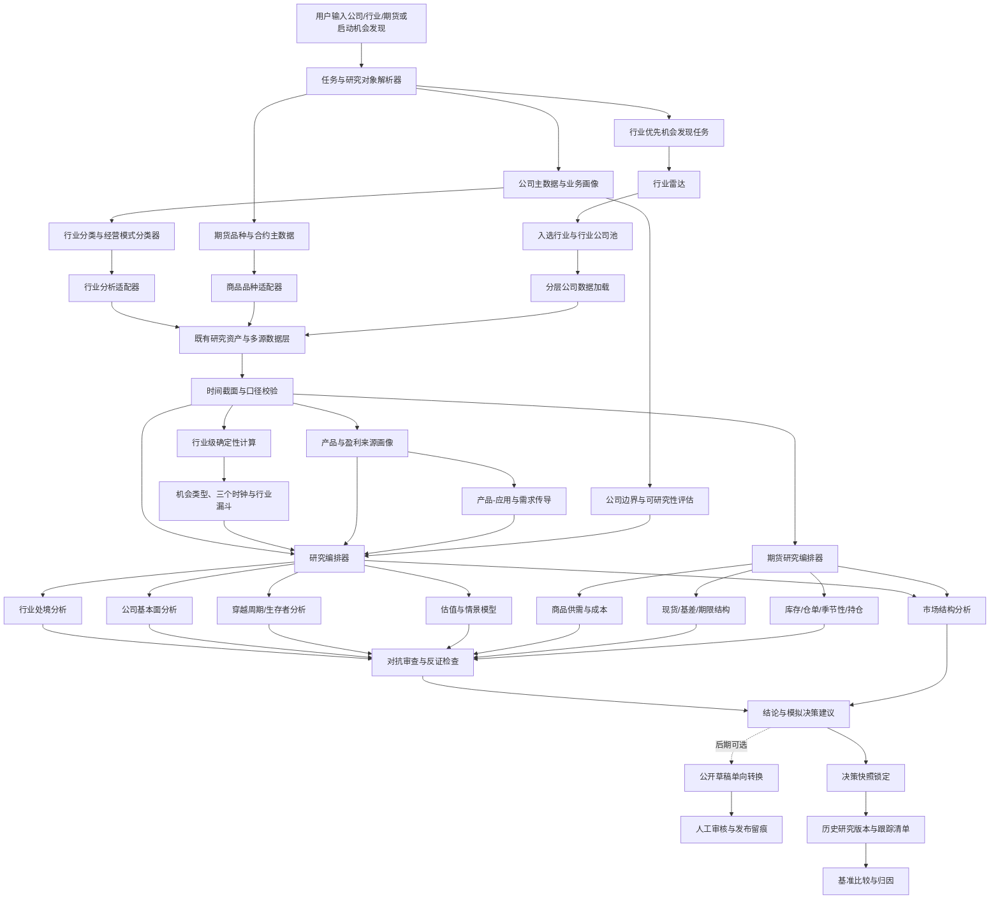

# AI 投研结论与模拟决策辅助系统

文档状态：v0.14，定稿第三方项目能力复用治理与替换设计。

本版在 v0.13 基础上把非 `luopan`、`ai-berkshire`、`czsc`、`chan.py` 项目的接入收口为“能力切片 + 候选评审 + 固定夹具 + 统一适配器 + 可回退退出”闭环。外部项目可以减少重复开发，但不能整体带入其数据口径、默认联网范围、交易执行能力或许可证风险；交易所/公司披露、东方财富、AKShare、BaoStock 的主备路线和既有研究资产复用边界保持不变。

## 1. 设计目标

本系统采用“指定对象研究 + 主动机会发现 + 通用研究编排器 + 数据源适配层 + 研究对象适配器 + 行业/品种适配器 + 证据库 + 可解释模型”的完整投研平台设计，首期支持 A 股、港股上市公司和国内商品期货，而不是为通威股份、光伏行业或某一个期货品种单独制作一套流程。

光伏/通威只作为第一个强周期制造适配器的验证样例。平台核心必须独立于光伏，后续可以切换到银行、保险、消费、医药、软件、资源、化工、设备、材料、公用事业、平台互联网等行业，并扩展黑色、有色、能源化工、农产品和新能源材料等国内商品期货品种。美股不进入首期范围，待数据授权和质量满足要求后再作为可选扩展。

核心原则：

```text
识别研究对象
  → 公司：识别行业、经营模式和盈利来源
  → 行业：建立行业结构、周期和代表公司池
  → 期货：识别品种、具体合约和现货产业链
  → 机会发现：从行业雷达进入行业公司池与少量深研
  → 选择行业或商品品种分析维度
  → 收集并锁定时间截面的证据
  → 分析行业/品种供需与周期处境
  → 公司：分析质量、生存能力和估值
  → 期货：分析现货、基差、期限结构、库存/仓单和合约约束
  → 建立情景模型
  → 生成结论、建议、反证和跟踪指标
```

平台能力边界：

```text
通用层：研究对象识别、证据、时间截面、研究版本、决策快照、归因
公司层：公司边界、产品画像、基本面、生存能力、估值和行业适配器
发现层：行业雷达、行业公司池、非对称性四维、三个时钟、硬否决和候选状态机
期货层：品种/合约、现货产业链、供需、库存/仓单、基差、期限结构和品种适配器
数据层：交易所/公司原始披露、东方财富、AKShare、BaoStock、行业/现货统计和研究资料适配器
基础组件层：PDF/年报解析、统计分析、任务触发和本地分析加速的可替换适配器
市场层：行情、复权/连续序列、市场结构、模拟研究和可选回放
传播层：锁定报告到公开草稿的单向转换、人工审核和发布留痕（后期）
执行边界：不自动下单，不连接实盘交易凭证
```

研究深度与计算方式正交：快速、标准、深度决定研究范围；`LOCAL_ONLY`、`LLM_ASSISTED` 决定是否调用大模型。数据采集、确定性指标、状态规则、模拟账本和历史回放属于本地核心能力，不得因 Token 不可用而失效。

## 2. 总体架构



## 3. 模块设计

### 3.1 输入与任务解析器

#### 输入类型

- A 股、港股证券代码；
- 公司名称、简称或股票链接；
- 行业名称或产业链主题；
- 不指定公司或行业的行业优先机会发现指令；
- 国内商品期货中文品种名、品种代码、具体合约代码或主力/连续标识；
- 持有论文建立、检查或到期复核指令；
- 从锁定研究版本生成公开传播草稿的指令（后期）；
- 更新已有研究报告的指令；
- 指定研究时点、模拟周期或风险偏好。

#### 输出对象

```json
{
  "task_type": "company_research",
  "subject_type": "listed_company",
  "identifier": "600438",
  "research_as_of": "2026-07-15",
  "simulation_mode": true,
  "execution_enabled": false,
  "requested_depth": "standard"
}
```

`task_type` 至少支持 `company_research`、`industry_research`、`futures_research`、`opportunity_discovery`、`thesis_check` 和后期的 `public_draft`。指定公司或行业时不强制先执行机会发现；机会发现命中候选后则复用同一个 `company_research` / `industry_research` 编排器深挖。

#### 任务解析实现协议

本地 `resolve-task` 将上述输入归一为不可变 `research-task-resolution.v1`。解析器只做语法分类和
安全闸门，不查询网络、不调用模型；如果显式提供本地轻量证券主数据快照，则只做精确匹配，否则
不把名称直接当成证券身份，也不从裸证券代码推断上市市场。
输出至少包含：

```text
task_type             company_research / industry_research / futures_research /
                      opportunity_discovery / thesis_check / public_draft / unresolved
subject_type          listed_company / industry / opportunity_scan /
                      futures_variety / futures_contract / continuous_series / unknown
identifier            用户原始标识的规范化值
research_as_of        研究截止日
status                READY / PARTIAL / NEEDS_CONFIRMATION / BLOCKED
identity_resolution   解析状态、市场/交易所确认要求和标识类型
requested_depth       QUICK / STANDARD / DEEP
simulation_mode       是否进入模拟研究语境
execution_enabled     永远为 false
```

带市场后缀的证券代码可完成语法级识别；裸代码和中文公司名可在唯一的本地证券主数据记录中精确
确认，否则需要证券主数据确认。若显式加载 `commodity-adapter.v1` 配置，中文别名/品种代码可以
完成期货品种的配置级分类；期货品种/具体合约/连续序列仍需要交易所主数据或连续序列规则确认。
解析结果写入
`data/research_tasks`，使用不可变存储并可独立校验，后续编排器只接受通过安全字段校验的任务对象。

机器可读摘要还必须包含产品盈利画像，不能只保存公司行业标签：

```json
{
  "primary_earnings_sources": [
    {
      "product": "待确认",
      "revenue_share": null,
      "profit_share": null,
      "customer_purchase_reason": "待确认",
      "system_layer": "待确认",
      "criticality": "待确认",
      "unit_value": null,
      "substitutability": "待确认",
      "direct_competitors": [],
      "substitute_technologies": [],
      "market_state": "待确认"
    }
  ]
}
```

系统将 `execution_enabled` 固定为 `false`，不提供将其改为 `true` 的产品入口。

### 3.2 公司识别器

#### 识别优先级

1. 精确证券代码 + 市场；
2. 证券代码全局候选；
3. 公司全称；
4. 证券简称；
5. 外部链接或用户提供的标识。

#### 识别流程

```text
输入标识
  → 标准化（去空格、大小写、市场后缀）
  → 查询公司主数据
  → 查询上市状态和行业分类
  → 查询业务描述与最新公告
  → 生成公司画像
  → 计算识别置信度
```

若出现多个候选，返回候选表并暂停深度分析。若公司是未上市公司，允许进入研究，但必须明确数据稀缺和估值不确定性。

### 3.2A 公司边界与可研究性评估

该模块在深度研究前运行，避免把集团、子公司、参股公司和概念标签混成上市公司的经营事实。

#### 研究范围对象

```text
ListedEntity       上市主体
ConsolidatedGroup  合并报表集团
Subsidiary         重要子公司
Associate          联营/合营企业
Unconsolidated     未并表业务或资产
RelatedParty       关联方及潜在利益传导
```

每个产品、订单、产能、收入、利润、现金和债务都必须绑定到上述范围中的一个对象，并记录是否能够传导到上市主体。参股公司的产品和订单只有在有持股、并表/权益法、订单归属和利润传导证据时，才能进入上市公司的结论或估值。

#### 可研究性状态机

```text
IDENTIFIED
  → SCOPE_CONFIRMED
  → DATA_SCREENED
  → READY / PARTIAL / INSUFFICIENT / BLOCKED
```

- `READY`：关键事实和口径基本齐全，可以进行标准研究；
- `PARTIAL`：可以研究，但受影响模块必须降级；
- `INSUFFICIENT`：只能初筛，禁止完整估值和确定性方向结论；
- `BLOCKED`：身份、范围或核心数据无法确认，暂停深度研究。

研究编排器将该状态作为硬约束传递给报告、估值和模拟决策模块。

### 3.2B 国内商品期货品种与合约识别器

期货识别器不能把品种、具体合约和连续价格序列混成同一个证券标识。统一对象层级为：

```text
FuturesVariety       商品品种及其现货产业链，例如螺纹钢
FuturesContract      可真实交易和模拟记录的具体月份合约
ContinuousSeries     按固定主力/换月/复权规则构造的研究序列
SpotBenchmark        与交割品或产业现货对应的价格基准
```

识别流程：

```text
输入中文名/品种代码/合约代码/连续标识
  → 解析交易所与对象类型
  → 校验交易所合约主数据和规则生效时间
  → 绑定商品品种与现货产业链
  → 若为连续序列，加载主力判定、换月、拼接和复权规则
  → 检查研究时点可用性、流动性和到期约束
  → READY / PARTIAL / INSUFFICIENT / BLOCKED
```

首期交易所范围为上期所、大商所、郑商所、上期能源和广期所的商品期货。金融期货使用不同的定价、基差和宏观因子模型，期权还需要波动率曲面和希腊字母模型，二者均不混入首期商品期货适配器。

连续序列只用于长期图表、市场结构和品种历史研究。任何模拟快照都必须绑定具体 `FuturesContract`；主力判定只能使用研究时点已经公开的成交量、持仓量和合约信息，禁止事后重选。

### 3.3 行业分类与分析适配器

不把“行业分类”仅作为标签，而是用它选择分析问题。

#### 分类维度

```text
industry_family       大类行业
industry_segment      细分行业
value_chain_position  产业链位置
business_model        经营模式
cyclicality           周期属性
asset_intensity       资产强度
demand_rigidity       需求刚性
competition_type      竞争结构
technology_risk       技术替代风险
policy_sensitivity    政策敏感度
product_exposure      产品暴露
application_exposure  应用场景暴露
growth_drivers        需求驱动来源
revenue_transmission  收入传导状态
```

#### 适配器接口

```python
class IndustryAdapter:
    name: str

    def classify(self, company_profile) -> dict:
        """返回行业属性、置信度和待补充信息。"""

    def required_metrics(self, company_profile) -> list[str]:
        """返回该行业必须采集的指标。"""

    def build_cycle_model(self, evidence_set):
        """在适用时返回周期模型；非周期行业可返回 None。"""

    def survival_questions(self, company_profile) -> list[str]:
        """返回行业低谷生存能力问题。"""

    def map_product_applications(self, company_profile, evidence_set) -> dict:
        """将公司产品映射到下游应用、客户和需求驱动。"""

    def assess_demand_transmission(self, product_application_map, evidence_set) -> dict:
        """判断风口需求是否已传导到订单、收入、利润和现金流。"""

    def validate_conclusion(self, draft_report) -> list[str]:
        """检查结论是否遗漏行业特有风险。"""
```

#### 适配器示例

| 适配器 | 主要指标 |
|---|---|
| `cyclical_manufacturing` | 产能、价格、现金成本、利用率、库存、资本开支、减值 |
| `resource` | 储量、品位、产量、现金成本、商品价格、资源期限 |
| `consumer_brand` | 渠道、复购、单店、品牌、库存、现金流、竞争 |
| `financial_services` | 资产质量、信用成本、资本充足率、利差、准备金 |
| `healthcare` | 管线、研发、审批、集采、商业化、专利期限 |
| `software_saas` | ARR、续费率、获客成本、毛利、研发、现金消耗 |
| `utilities` | 牌照、利用率、价格机制、资本开支、负债、现金流 |

产品和应用层不作为独立的证券行业分类，而是叠加在行业适配器之上。比如一家被归类为“化工”的材料公司，可以同时拥有“新能源电池材料”“半导体材料”等应用暴露，系统必须分别分析其需求和盈利传导。

当置信度不足时，使用 `generic_company`，并把“行业识别不确定性”放进报告，而不是假装分类准确。

### 3.4 多源数据与证据层

该层负责接入、规范化、校验和保存多种数据与研究来源。所有来源都必须进入统一证据模型，不能让某个外部项目或接口直接绕过时间截面和证据审查。

#### 来源角色

| 来源 | 主要用途 | 约束 |
|---|---|---|
| 原始公告、年报、季报、审计报告 | 公司事实、财务、重大事项和会计口径 | 事实底座；保留原文、版本和更正链 |
| 交易所/公司原始披露 | 公司事实、财务口径、公告、期货规则和正式统计 | 事实底座；保留原文、发布时间、版本和更正链 |
| 东方财富接口 | 行情、公开财务、指数和市场数据补充 | 聚合采集来源；记录接口、参数、抓取时间和响应版本 |
| AKShare | 行情、财务、指数、行业和期货数据便捷采集 | 统一采集入口；关键字段回溯原始来源，记录接口版本和抓取时间 |
| BaoStock | A 股历史行情、复权序列和交易日历补充 | 与东方财富、AKShare 组成备用链路；不覆盖港股、期货和原始公告 |
| 国内期货交易所公开资料 | 合约规格、规则版本、交易日历、结算参数、库存/仓单、交割和公告 | 合约与交割事实底座；按生效时间保存历史规则 |
| 现货与行业公开来源 | 现货价格、产量、开工、库存、进出口、成本和产业利润 | 保存统计范围、频率、发布时间和修订规则；关键数据交叉校验 |
| `luopan` | 直接导入已有公司/行业画像、代表公司池、八指标初筛、公告索引和研究产物；复用研究路由、信源分级、任务拆解和对抗验证能力 | 公司池不替代全市场主数据，八指标不替代行业专属评级，对抗验证不等于事实自动核真 |
| `ai-berkshire` | 直接导入已有公司/行业信息、基本面研究资产和跟踪记录；复用估值与投研工作流 | 画像字段按复用策略导入；估值、目标价和观点仅作为外部研究产物 |
| 政府、交易所、行业协会和正式统计 | 行业供需、政策、产能、价格和宏观数据 | 标注统计口径、发布日期和适用范围 |
| 研究报告、媒体和网络资料 | 竞争线索、产业访谈和待验证假设 | 辅助证据，不能单独支撑关键事实 |
| 豆包、腾讯元宝、DeepSeek 等网页 AI | 交互式资料搜索、行业脉络整理、竞争线索、反证和待核验问题 | 仅人工粘贴/导入；默认为 C/D 级线索，不替代官方数据，不进入自动定时扫描 |

#### 统一数据对象

```text
SourceDocument        原始文档或原始数据文件
MarketDataSnapshot    行情、指数、复权和交易日历快照
Evidence              从来源提取并定位的事实证据
ModelAssumption       模型输入和人工假设
ResearchArtifact      luopan/ai-berkshire 等研究流程产生的中间结果
ResearchCandidateSet  特定研究边界和时间截面下的代表/候选公司集合
ScorecardArtifact     通用或行业专属评分卡及其证据完整度
```

#### 数据源适配器接口

```python
class DataSourceAdapter:
    name: str
    source_type: str
    version: str

    def fetch(self, query, as_of):
        """获取原始对象；必须返回发布时间、抓取时间和来源版本。"""

    def normalize(self, raw_object):
        """转换为统一对象，不直接生成投资结论。"""

    def health_check(self) -> dict:
        """返回可用性、延迟、字段完整度和最近错误。"""
```

#### 数据源固定响应夹具与路由回归

数据源测试采用本地固定响应夹具，不把网络可达性混入核心回归。夹具目录按来源和能力切片组织，至少覆盖：

| 来源 | 代表形态 | 必测边界 |
|---|---|---|
| `official_exchange` / `company_disclosure` | JSON/文本公告或正式披露响应 | 内容类型、发布时间/主体字段、空响应、HTTP/解析失败 |
| `eastmoney` | 聚合接口 JSON 包装和行情字段 | 参数保留、嵌套字段、空 `diff`、字段缺失 |
| `akshare` | 显式 endpoint 返回记录列表或表格转换结果 | endpoint/参数/版本、空表、列缺失、可选依赖缺失 |
| `baostock` | 登录会话和历史记录结果 | 登录失败、查询失败、登出、历史字段和可选依赖缺失 |

固定夹具只证明适配器的输入输出和路由协议可重建，不证明远端接口当前可用。每次主备回归必须验证：

```text
主来源失败/空结果/字段不足
  → 备用来源继续尝试
  → DataSourceAttempt 保留状态、原因和诊断
  → DataSourceRefresh 保存实际返回、稳定哈希和截断状态
  → validate-data-refresh 在本地通过
```

端到端夹具不得调用网络、不得读取用户凭证，也不得把固定响应直接升级为 `Evidence` 或投资结论。真实远端接口的定期可用性检查与本地协议回归分开记录；前者失败不能使后者不确定，后者通过也不能替代前者。

#### 第三方基础组件适配器

第三方项目不直接进入研究编排器、证据库或决策模块，而是通过按能力拆分的可替换适配器接入。适配器负责版本、许可证、依赖、异常和统一输出，核心业务层不依赖外部项目的内部类或文件结构。

```python
class DocumentParserAdapter:
    name: str
    version: str
    license_snapshot: str

    def parse(self, raw_document, *, document_id, as_of):
        """返回带页码/坐标、内容哈希和解析版本的本地提取结果。"""

    def health_check(self) -> dict:
        """检查可选依赖、Mac 运行环境和解析能力，不访问远端。"""


class PerformanceMetricsAdapter:
    name: str
    version: str

    def calculate(self, locked_series, benchmark_series, *, as_of):
        """只返回收益、回撤、波动率等统计结果，不改变归因结论。"""


class TriggerRuntimeAdapter:
    name: str
    version: str

    def register(self, task_plan):
        """只触发本系统已有任务计划，不持有研究事实。"""


class AnalyticalQueryAdapter:
    name: str
    version: str

    def query(self, immutable_snapshots, query):
        """只读查询不可变快照，返回可重建的分析结果。"""
```

首轮第三方组件选型与边界如下：

| 能力 | 候选组件 | 设计判定 | 适配边界 |
|---|---|---|---|
| PDF 基础提取 | `pypdf` | `ADAPTER_REUSE` | 页面拆分、文本、元数据和本地文件处理；不负责字段事实核验 |
| PDF 文本/表格定位 | `pdfplumber` | `ADAPTER_REUSE` | 记录页面、坐标和抽取文本；优先处理可复制文本年报 |
| PDF 表格补充 | `Camelot` | `ADAPTER_REUSE` | 仅在固定样本验证通过后调用；失败时回退人工/其他解析方式 |
| 绩效统计 | `quantstats` | `ADAPTER_REUSE` | 计算收益、回撤、波动和辅助图表；决策快照、基准锁定和归因仍由本系统负责 |
| 调度触发 | `APScheduler` | 条件 `ADAPTER_REUSE` | 可替换当前本地触发层，但不得替换 `scheduler.py` 的任务状态、审计和重试语义 |
| 本地分析查询 | `DuckDB` | 条件 `ADAPTER_REUSE` | 在 JSON/对象快照之上建立读模型；不作为唯一事实库，不覆盖历史版本 |
| 批量计算 | `Polars` | 条件 `ADAPTER_REUSE` | 仅在性能基准显示 pandas/标准库不足时启用；结果必须回归一致 |
| 免费行情候选 | `efinance`、`easyquotation`、`qstock` | 条件 `ADAPTER_REUSE` | 只做行情备用候选；不得替代交易所/东方财富/AKShare/BaoStock 主备路线 |
| Token 数据服务 | `Tushare` | `REFERENCE_ONLY`/可选 | 需要 Token、积分或服务规则时才启用，费用和服务依赖单独审计 |
| 大型量化平台 | `Qlib`、`OpenBB`、`vn.py`、`QUANTAXIS` | `REFERENCE_ONLY` | 不整体嵌入，不引入其交易、模型或全量数据假设 |
| 复杂文档平台 | `Docling`、`Unstructured`、`MinerU` | 实验 `REFERENCE_ONLY` | 先做中国上市公司年报基准和许可证/附加条款审查，再决定是否适配 |

选择顺序固定为：

```text
pypdf + pdfplumber（基础年报解析）
  → Camelot（表格专项补充）
  → quantstats（归因前统计辅助）
  → APScheduler（触发器，可选）
  → DuckDB/Polars（数据量或性能达到阈值后可选）
```

在以下条件满足前，不引入对应组件：

- PDF 解析：至少使用固定的 A 股/港股年报、审计报告和公告样本验证文本、表格、页码定位、中文字符和失败降级；
- 统计组件：至少与现有 `attribution.py` 的收益、回撤、波动率和基准样本做逐项回归；
- 调度组件：至少验证任务幂等、重试、延迟、事件触发、容量限制和 `LOCAL_ONLY` 结果不变；
- DuckDB/Polars：只有当数据量或查询性能达到预设阈值，且读模型可从不可变快照重建时才启用；
- 行情候选：必须核实许可证/使用条款、接口稳定性、限流、历史时间截面、字段完整性和 Mac 兼容性。

许可证或维护状态不清、仓库许可与包元数据冲突、存在附加商业条款或强制在线服务标识的组件，默认标记 `LICENSE_REVIEW_REQUIRED`，不得进入默认安装组。GPL/AGPL 项目不作为本系统核心依赖；确需采用时必须隔离进程、完成法律评估并记录退出方案。

第三方适配器输出必须经过以下边界：

```text
第三方输出
  → adapter_result（版本、原始输入哈希、组件信息）
  → SourceDocument / Evidence / MarketDataSnapshot / ResearchArtifact
  → 本系统时间截面、口径和冲突校验
  → 研究报告或统计辅助
```

不得出现“第三方解析成功 = 事实已核验”“第三方统计结果 = 因果归因”或“第三方平台信号 = 买卖建议”的隐式升级。

#### 外部项目候选发现与能力裁剪

外部项目评估器不以仓库为最小接入单位，而以 `capability_slice` 为最小接入单位。候选可以来自已有 vendor、GitHub、PyPI、系统包或用户提供的本地代码，但进入评估前必须先回答“它具体替代本系统哪一个能力缺口”。项目的其他模块默认不加载、不安装、不复制。

候选评审对象 `third-party-candidate-review.v1` 与能力矩阵关联，结构如下：

```text
candidate_id / capability_slice / project_url / package_name
discovered_at / version_or_commit / license_snapshot / license_status
requested_capability / excluded_capabilities / dependency_manifest
network_required / token_required / account_required / execution_surface
temporal_cutoff_support / future_function_risk / reproducibility
fixture_ids / baseline_id / pilot_result / regression_result
adapter_id / fallback_id / decision / rejection_reason
reviewed_at / next_review_at / owner
```

评审器按以下状态推进，并将每次状态变化写入不可变决策记录：

```text
DISCOVERED
  → CAPABILITY_SCOPED
  → LICENSE_AND_SECURITY_REVIEWED
  → FIXTURE_VALIDATED
  → ADAPTER_PILOTED
  → ACCEPTED / CONDITIONAL / REFERENCE_ONLY / REJECTED
```

能力裁剪规则：

- 只需要字段转换、错误映射、版本/时间截面记录或证据连接时，判定为 `ADAPTER_REUSE`，不复制上游算法；
- 可选包接口稳定、输出可复现、输入输出边界清晰时，才考虑 `DIRECT_REUSE`，且仍必须经过统一适配接口；
- 只有许可证允许、上游停止维护或存在明确且可长期承担的缺口时，才考虑 `FORK_AND_MODIFY`；每个补丁必须有上游基线、差异说明和回合并计划；
- 项目只提供思路、算法或测试样例时，判定为 `REFERENCE_ONLY`，不作为运行时依赖；
- 含账户连接、自动交易、未经核实的强制在线数据、隐式未来数据、不可解释默认值或许可证不明的能力，默认拒绝进入生产链。

发现新行情或研究项目时，先在能力矩阵中登记候选，再与现有主备路线做增量比较。任何候选都不能删除交易所/公司披露、东方财富、AKShare、BaoStock 的主备顺序；最多作为经过许可、字段、限流、历史截面和 Mac 验证后的额外备用适配器。

#### 固定夹具、基线与验收门

每个适配器必须绑定固定夹具和本地基线。夹具至少包含正常、空值、缺字段、格式异常、依赖缺失、重复运行和截止日边界样本；文档解析还需覆盖中文年报、跨页表格、扫描/不可复制文本和公告更正；统计适配还需覆盖收益、回撤、波动、缺失日期和基准锁定；调度/分析适配还需覆盖幂等、重试、不可变快照和从零重建。

验收不是只看进程退出码，而是逐项比较：

```text
值/状态/错误级别/证据定位/输入哈希/版本/输出顺序
```

只有在许可证审查通过、固定夹具回归通过、资源成本可接受、异常回退成功、卸载后核心链路仍可运行，候选才可标记 `ACCEPTED`。`CONDITIONAL` 必须绑定启用阈值、适用输入和人工复核；`REFERENCE_ONLY`、`REJECTED` 和 `LICENSE_REVIEW_REQUIRED` 不能进入默认安装组。

组件升级必须注册新版本、保留旧版本和旧产物，先在隔离环境回归后再切换。许可证、仓库、依赖或输出协议发生变化时，即使代码未升级也必须重新评审。连续失败、许可证风险、维护停止或安全事件触发退出流程：停止新任务、切换回退实现、保留历史可读产物、更新能力矩阵，禁止静默替换或删除历史血缘。

#### 候选评审与运行注册的边界

候选评审对象和运行组件注册对象采用“两阶段登记”：候选评审负责回答“是否值得验证”，运行注册负责回答“当前哪一个已验证版本可以被适配器调用”。两者都不可覆盖，运行注册必须引用候选评审的最终状态。

```text
项目来源元数据
  → third-party-candidate-review.v1
  → capability_slice 拆分
  → 许可证/安全/平台/时间截面审查
  → 固定夹具与本地基线
  → 隔离环境适配器试运行
  → third-party-component-registry.v1
  → 研究任务按能力路由
```

评审最小单位是能力切片，不是仓库。一个项目可以同时产生 `pdf_text`、`pdf_table`、`performance_metrics` 等多个切片；每个切片必须独立保存输入边界、排除模块、版本、许可证、夹具、回退和结论。候选登记阶段只保存元数据，不自动下载、安装、联网、登录或触发交易能力。只有进入 `FIXTURE_VALIDATED` 后，才允许在隔离环境获取固定版本进行 `ADAPTER_PILOTED`。

运行注册只允许引用 `ACCEPTED` 或满足明确启用条件的 `CONDITIONAL` 切片。`REFERENCE_ONLY`、`REJECTED`、`LICENSE_REVIEW_REQUIRED` 和 `DISABLED` 不得被运行时发现。`CONDITIONAL` 必须同时提供启用阈值、适用输入、人工确认人和到期复核日期；到期未复核时自动降级为不可用，不静默继续运行。

新增行情或数据项目的接入仍走统一 `DataSourceAdapter` 与 `DataSourceRouter`。候选项目的返回值必须先形成 `DataSourceAttempt`，通过字段完整度、来源类型、发布时间、研究截止日、限流和冲突校验后，才能成为可引用快照；它不能绕过交易所/公司披露、东方财富、AKShare、BaoStock 的主备链路，也不能把远端接口“健康”误判成这次抓取成功。

组件退出采用反向流程：停止新任务引用 → 生成 `DISABLED` 新注册版本 → 切换回退实现 → 保留旧适配器、旧版本和历史产物 → 更新能力矩阵与影响范围。历史报告不能重建时，只标记“历史产物可读、当前组件不可重建”，不能删除血缘或伪造重建成功。

#### 外部项目获取、收益与退出门

候选评审通过前只保存项目元数据、能力切片和风险记录，不安装或执行整个仓库。进入试运行后也必须使用固定版本、隔离环境和最小导入面：可选包使用锁定版本和哈希，复杂依赖使用独立进程或虚拟环境，只有许可证允许且维护责任明确时才允许维护最小 fork。不得使用动态版本、未审查的安装脚本、隐式远程下载、用户凭证或上游默认的全市场扫描范围。

适配器验收除功能回归外，还要和本地实现建立收益—成本基线。评审记录至少比较以下维度：

```text
避免的重复开发/维护工作
  ↔ 字段完整度、准确率、运行时间、内存、历史截面和异常覆盖改善
新增依赖、升级、许可证、供应链、网络和退出成本
  ↔ 可验证的质量、性能、覆盖率或研究效率收益
```

只有在收益明确、可重复验证且不破坏证据血缘、时间截面、主备路由、模拟账本和执行禁用边界时，能力切片才可标记 `ACCEPTED`；收益依赖输入范围或人工复核时标记 `CONDITIONAL`，并记录启用阈值、负责人和到期日。仅仅与现有实现功能相似、节省不了实际工作或维护成本更高的项目，保留为 `REFERENCE_ONLY` 或 `REJECTED`。

运行时路由只发现已验收的固定版本，不根据仓库最新提交自动升级。退出流程为：停止新任务引用 → 生成新的 `DISABLED` 注册版本 → 切换回退实现 → 保留旧版本、适配器和历史产物 → 更新能力矩阵与影响范围。组件连续无使用、收益无法复现、上游停止维护、许可证/依赖/服务条款变化或回退演练失败时，触发退出或重新评审；历史报告只能标记当前组件不可重建，不能删除原始血缘或伪造重建成功。

#### 既有研究资产复用适配器

`luopan` 和 `ai-berkshire` 不仅是方法参考，也可以作为已有研究资产来源。系统优先读取其已产生的公司/行业画像和研究索引，避免重复调用或重写同类信息获取逻辑。

```python
class ResearchAssetAdapter(DataSourceAdapter):
    def discover(self, identifier, as_of):
        """查找已有公司画像、行业画像、公告索引和研究产物。"""

    def map_company_profile(self, asset) -> dict:
        """映射代码、市场、名称、行业、业务和产品字段。"""

    def import_artifact(self, asset) -> dict:
        """导入研究中间结果并保留原项目、版本和生成时间。"""

    def import_candidate_set(self, asset) -> dict:
        """导入代表公司池；必须声明研究边界、时间截面和完整性主张。"""

    def import_scorecard(self, asset) -> dict:
        """导入评分卡；保留指标定义、评分年度、缺失项和证据完整度。"""

    def validate_identity(self, mapped_profile, authoritative_sources) -> dict:
        """对公司身份和关键分类做轻量一致性校验。"""
```

复用策略分为三层：

```text
DIRECT_REUSE       公司身份、市场、行业、主营业务等匹配字段直接预填
REUSE_WITH_CHECK    产品、分部、行业标签等经过原始资料或多源轻量校验后使用
METHOD_REUSE        研究路由、信源分级、八指标初筛和对抗检查作为可版本化方法执行
REFERENCE_ONLY      估值、目标价、买卖观点和研究结论只作为外部研究产物引用
```

`luopan`、`ai-berkshire` 和本系统的字段映射、版本、时间截面、校验状态必须记录在 `research_artifacts` 中。只有字段缺失、资产过期、来源冲突或身份无法匹配时，才对受影响字段进入新的数据抓取流程。

`luopan` 产生的公司池保存为 `ResearchCandidateSet`，只能用于候选发现和横向比较，不能覆盖 `companies` 或证券主数据。八指标保存为 `ScorecardArtifact(generic_power_screen)`；行业适配器追加专属评分后才能形成最终研究评级。信源分级、来源清单和对抗审查分别保存，审查通过只表示流程完成，不能把 `company_claim` 自动转换为 `verified_fact`。

网页 AI 只支持 `MANUAL_WEB_AI` 人工输入，不调用网页接口、不自动登录、不模拟点击、不批量抓取聊天内容；记录提供方、模型/会话、问题、完整回答、获取时间和回答中的来源链接。带来源的网页 AI 内容保存为 `C_external_ai_lead`，无来源或时间/主体/口径不明的内容保存为 `D_unverified_model_claim`；两者都必须经过官方资料或独立来源核验后才能升级为正式证据。

数据源不可用时，系统应按字段主备顺序切换备用来源或降低受影响模块的结论强度。来源发生失败、超时、限流、空结果或字段不完整时，必须记录尝试日志、失败原因和最终选用来源；全部来源失败才降级为本地快照或 `INSUFFICIENT`，不得使用静默默认值。东方财富、AKShare 与 BaoStock 数据不一致时，各方数据都保留并记录裁决原因。期货行情、结算、持仓、仓单和合约规则优先回溯交易所公开资料，不能假设任何单一聚合接口覆盖全部现货与产业数据。

默认来源路由器按字段维护有序链路：

```text
公司事实/公告：交易所或公司披露 → 东方财富 → AKShare → BaoStock
A 股行情：交易所/东方财富 → AKShare → BaoStock
行业数据：交易所/协会/政府 → 东方财富 → AKShare
期货合约与仓单：交易所 → 东方财富 → AKShare
```

路由器返回最终来源和完整 `DataSourceAttempt` 列表，数据源健康检查失败时跳过该来源，单次请求异常时继续尝试下一个来源。

数据源健康检查独立生成不可变 `data-source-health.v1` 快照。快照按来源记录适配器类型、版本、能力、
可用状态和不可用原因，并按研究对象输出 `primary_source`、`fallback_sources`、`rejected_sources`、
能力要求和 `READY/INSUFFICIENT` 路由状态。健康检查只证明本地适配器和可选依赖的就绪程度，不证明
远端端点本次可达、返回非空或字段完整；真实 `fetch` 必须继续执行并保存 `DataSourceAttempt[]`。

快照保存到 `data/source_health`，使用 `JsonSnapshotStore.write_immutable`，禁止按相同 ID 覆盖。研究
版本的 `source_health_snapshot_id` 和调度任务结果的同名 ID/path 只作审计引用，不把健康状态升级为
事实证据。AKShare、BaoStock 等可选依赖缺失时记录 `available=false` 和原因，仍允许交易所/公司披露、
东方财富等其他来源按既定主备顺序尝试。

#### 证据分层

```text
A 级：交易所公告、年报、季报、审计报告、正式统计
B 级：行业协会、政府文件、公司正式路演材料、高质量研究
C 级：权威媒体、供应链访谈、市场传闻、社交媒体
```

网页 AI 线索不与 A/B/C 事实等级混用：

```text
C_external_ai_lead       网页 AI 回答中带来源链接的研究线索
D_unverified_model_claim 无来源或无法确认时间、主体和口径的模型表述
```

网页 AI 只能用于交互式资料整理、研究假设和反证发现，不能单独触发行业反转确认、公司生存闸门、`CANDIDATE` / `REVIEWABLE`、目标价基准情景或模拟决策锁定。

#### 证据对象

```json
{
  "evidence_id": "ev_20260715_0001",
  "issuer": "600438",
  "metric": "cash_and_equivalents",
  "value": 123.45,
  "unit": "CNY_billion",
  "period": "2025-12-31",
  "published_at": "2026-04-30",
  "source_type": "annual_report",
  "source_url": "...",
  "page": 42,
  "as_of": "2026-07-15",
  "available_before_as_of": true,
  "confidence": "A",
  "extraction_method": "manual_verified",
  "content_hash": "sha256:...",
  "source_document_version": "doc_20260715_v1",
  "parser_version": "公告解析器-0.1.0",
  "manual_override_id": null
}
```

#### 时间截面规则

- `period` 表示数据对应的经营期间；
- `published_at` 表示市场可获得该信息的时间；
- 研究时点只能使用 `published_at <= research_as_of` 的证据；
- 后续修订数据不能回填到旧报告，除非显式创建修订版本；
- 当前报告和历史复盘报告分离存储。

#### 数据冲突处理

1. 统一单位、币种和会计口径；
2. 记录不同来源的原始值；
3. 计算差异并标记；
4. 以更高等级、更新且口径明确的来源为主；
5. 无法解决时在报告中展示冲突，不强行取平均数。

#### 原始资料不可变规则

原始公告、财报、行业数据和行情文件作为不可变对象保存。系统记录内容哈希、发布时间、抓取时间、文件版本、解析器版本和原文定位。公告更正、补充或撤回时创建新对象，不覆盖旧对象，并由影响分析器标记受影响的研究版本、假设和决策快照。

披露模板适配器是原始公告采集层与统一证据层之间的薄连接层，配置协议为
`announcement-template-catalog.v1` / `announcement-template.v1`。首期模板 ID 为：

| 模板 | 来源/市场 | 主要用途 |
|---|---|---|
| `official_exchange` | 交易所公开披露，A 股/港股/期货 | 交易所公告、财报、规则和正式统计 |
| `company_disclosure` | 上市公司披露，A 股/港股 | 公司公告、财报、投资者关系材料 |
| `eastmoney_announcement` | 东方财富聚合公告，A 股/港股 | 公告索引和原文补充，关键事实需回溯原始来源 |
| `futures_exchange_disclosure` | 国内期货交易所，期货 | 合约规则、仓单、库存和交易所通知 |

每个模板必须声明 `source_name`、`source_family`、`market_scope`、`url_contract`、
`accepted_formats`、`document_type_rules`、`field_rules`、`required_fields`、
`failure_policy`、`template_version` 和 `document_type_mapping_version`。`url_contract`
只用于记录具体 URL/参数形态，解析器不执行网络请求。

本地解析入口为 `announcement-parse`：读取用户提供的 JSON、HTML 或文本快照，按模板依次尝试
JSON path、HTML meta/标题、标签和值、正则定位；输出 `original-announcement-input.v1`，并保留
`field_locators`、`original_content_locator`、输入格式、内容哈希、解析器版本和
`source_attempts[]`。状态规则如下：

```text
READY       必需字段已提取，纠正/撤回链完整
DEGRADED    文档类型未映射，降级为通用 announcement，但资产字段仍可校验
BLOCKED     发布时间、标题、主体、来源 URL 或纠正父文档缺失/非法，只能人工补录
```

解析输入可以保存原始文件路径和哈希，但不能以 `source_url` 代替原文。解析失败记录仍是不可变
审计对象；`BLOCKED` 不得直接提升为 `original-announcement-asset.v1`。解析通过后再调用现有
`build_announcement_asset`，由资产层执行发布时间/抓取时间、内容哈希、版本和更正关系的最终校验。
聚合来源生成的输入默认仍属于辅助来源，不能因为模板解析成功就升级为 A 级事实。

公告影响分析器输出 `research-impact-queue.v1`。它按事件主体、事件类型和事件时间匹配已保存的
`research-version.v1`，记录受影响版本、受影响模块、时间关系、下一步动作和复核状态。事件早于
研究截止日时，动作是 `CREATE_REVISED_VERSION`；事件晚于研究截止日时，动作是
`CREATE_NEXT_VERSION_DO_NOT_BACKFILL`；没有匹配版本时也必须保存 `NO_MATCHING_VERSION`。
该队列是只读复核对象，不改变历史版本、持有论文或决策快照。

#### 研究版本清单与回放

所有公司管线、行业雷达、每日增量、事件复核和公司池刷新都必须生成轻量的
`research-version.v1` 清单。清单不复制正文，只保存研究截止日、上一版本 ID、研究对象、
管线/补充证据/统一证据包/行情快照/调度产物引用、受影响模块、执行模式、来源 ID、规则版本、
内容哈希、版本状态和复核状态。`pipeline_id`、`supplemental_id`、`evidence_bundle_id`、
`market_data_snapshot_ids`、`source_health_snapshot_id` 与 `artifact_refs` 构成可回放血缘。健康快照
只记录适配器 readiness，不能替代实际数据抓取的尝试链。

历史研究版本、证据、行情和决策对象使用 `write_immutable` 只写一次；调度器的 state、计划和
重试状态允许覆盖。版本校验必须验证 schema、不可变标志和内容哈希；版本比较只输出字段、状态
和引用差异，不改写任一版本。回放默认 `LOCAL_ONLY`，只接受人工提供的已保存产物，不联网、不
调用模型、不生成方向性结论；缺少产物为 `REFERENCE_ONLY`，哈希冲突或时间截面越界为 `BLOCKED`。

### 3.5 研究编排器

研究编排器负责调用工作流，不负责自行“想象”数据。

#### 研究深度、执行模式与 Token 路由

```text
QUICK     复用既有资产 + 本地指标 + 关键缺口；大模型可选
STANDARD  完成核心公司/行业链；仅对语义任务和受影响模块调用大模型
DEEP      正式调用 luopan 深度流程及所需 ai-berkshire 工作流，执行完整对抗审查

LOCAL_ONLY    不调用大模型；更新确定性数据、状态和差异，沿用最后锁定结论
LLM_ASSISTED  仅把无法由规则可靠完成的语义任务交给大模型
```

默认先运行资产发现、数据新鲜度检查和差异检测，再决定研究深度与受影响模块。只有产品/应用语义映射、产业关系判断、证据冲突解释、结论合成和对抗审查等任务可以要求大模型。行情、财务比率、八指标计算、周期序列、市场结构、估值公式、模拟账本和基准归因必须由确定性代码执行。

每次大模型调用写入 `llm_runs`，记录 `research_id`、研究深度、触发原因、受影响模块、模型、方法/提示词版本、证据清单哈希、输入/输出 Token、估算成本、开始/结束时间和状态。达到预算上限时切换到 `LOCAL_ONLY`，不允许因降级而补造结论。

`MANUAL_WEB_AI` 与 `LLM_ASSISTED` 是不同模式：前者表示用户在外部网页完成交互后人工导入结果，后者表示本系统调用已授权的模型能力。两者都必须记录来源和执行审计；网页 AI 免费不代表内容可复现，也不代表可以替代行业雷达的确定性数据。

#### 公司研究标准工作流

```text
Phase 0 任务确认与公司识别
Phase 1 读取既有研究资产并进行公司身份轻校验
Phase 2 公司边界与可研究性评估
Phase 3 行业画像和资料清单
Phase 4 原始公告与行业资料收集（仅补齐缺失或冲突字段）
Phase 5 数据清洗、时间截面和来源校验
Phase 6 产品与盈利来源画像
Phase 7 产品、材料与应用场景映射
Phase 8 风口需求传导与兑现分析
Phase 9 行业处境分析
Phase 10 产业供需与周期反转分析（适用行业）
Phase 11 公司商业模式与竞争位置
Phase 12 生存能力、极端压力和反转受益能力
Phase 13 财务、周期、反向估值和情景估值
Phase 14 市场结构状态分析（可选）
Phase 15 对抗审查、反证和质量检查
Phase 16 生成报告与后续跟踪清单
Phase 17 模拟决策前锁定快照
Phase 18 到期复盘、基准比较和归因
```

#### 国内商品期货标准工作流

```text
Phase F0  任务确认与品种/合约/连续序列识别
Phase F1  加载交易所合约规则、交易日历和研究时点
Phase F2  建立现货品、上下游产业链和关键指标清单
Phase F3  收集供需、产量、开工、检修、进出口和政策证据
Phase F4  对齐现货、库存、仓单、持仓和数据发布时间
Phase F5  计算基差、月差、期限结构、成本和产业利润
Phase F6  检查季节性、天气、运输、交割和仓单有效期
Phase F7  建立悲观/基准/乐观供需与价格情景
Phase F8  市场结构状态分析（可选）
Phase F9  对抗审查：未来函数、主力切换、数据修订和交割风险
Phase F10 生成期货报告、证据缺口和跟踪清单
Phase F11 用户确认后，对具体合约锁定模拟决策快照
Phase F12 到期/移仓/退出复盘，进行基准比较和期现归因
```

#### 增量更新工作流

```text
读取最后有效研究版本
  → 获取新增/更正证据和最新确定性数据
  → 计算字段差异与失效条件命中情况
  → 建立受影响模块集合
  → LOCAL_ONLY：更新数据状态、保留原结论、生成待复核清单
  → LLM_ASSISTED：只重算受影响模块并执行针对性对抗审查
  → 创建新版本并保留前后差异，不覆盖旧结论
```

增量执行器保存 `recompute_plan`。原始补充证据改变了 `company-supplemental-evidence.v1`，因此安全起点
是 `product_profile`，随后重算其依赖的下游阶段；只有补充证据完全未变化、且显式提供独立市场结构快照时，
才允许从 `adversarial_review` 开始，复用 `product_profile` 至 `valuation_scenarios` 的不可变阶段。旧阶段
必须通过版本和输入 ID 校验，复用失败时降级为完整有界管线或 `BLOCKED`，不能静默使用旧事实。

#### 非对称机会发现工作流

```text
Phase O0  锁定扫描范围、行业分类、数据截止时间和规则版本
Phase O1  仅计算行业级需求、库存、价格、成本、利润、资本开支、供给退出和事件特征
Phase O2  识别少量行业候选、行业状态和机会类型
Phase O3  调用 luopan 行业研究，导入行业结构、代表公司池、八指标初筛和对抗验证
Phase O4  为入选行业建立 10-30 家公司池，补齐公司身份、主营、产品和成员历史
Phase O5  对公司池做轻量财务、现金流、负债、成本、份额和估值筛选
Phase O6  执行生存、治理、产品替代、证据和估值硬否决
Phase O7  计算下行保护、拐点证据、利润弹性和未充分定价四维
Phase O8  复用 ai-berkshire industry-funnel / bottleneck-hunter / quality-screen 缩池
Phase O9  对 3-5 家补充数据，对不超过 3 家复用 company_research 与 investment-research 深研
Phase O10 使用反向估值、少量行情和 czsc/chan.py 描述市场时点与波动
Phase O11 对抗审查、保留淘汰原因，生成 WATCH / CANDIDATE / REVIEWABLE 或空集
Phase O12 用户确认后建立持有论文和模拟决策快照
Phase O13 每日行业/候选增量、周期更新、事件触发复查与状态迁移
```

O1-O2 必须在 `LOCAL_ONLY` 下可运行，并且只处理行业级数据；不得为全市场每家公司调用大模型。O3-O11 只处理入选行业及其缩小后的公司候选，并复用既有 Skill。`industry-funnel` 中基于涨幅或成交活跃度的召回只作为候选发现，不是价值判断；其“操作信号”和仓位建议不进入本系统。`thesis-tracker` 复用假设与红线追踪机制，但所有真实交易措辞改为用户确认后的模拟研究状态。

机会发现调度默认如下：

```text
industry_radar_refresh 按行业指标发布周期更新行业横截面，不下载全市场个股深度数据
daily_delta_scan       每个交易日，处理行业级新增数据和观察池/候选池增量
event_triggered_scan   重大政策、价格突变、停产破产、订单、业绩预告等事件触发
company_pool_refresh   行业入选或成员变化时，加载 10-30 家公司轻量数据
deep_research_limit  单轮最多 3 家
candidate_capacity  默认 15 家
watch_capacity      默认 30 个行业/主题、60 家公司
```

容量是上限而非配额。扫描结果允许为空，编排器不得为了生成报告降低门槛。

事件任务默认只生成影响队列和待复核记录。如果事件 payload 同时提供以下三个本地文件引用：

```text
previous_pipeline_path       上一版 company-research-pipeline.v1
previous_supplemental_path   上一版 company-supplemental-evidence.v1
evidence_path                新增证据记录列表或包含 records 的 JSON
```

执行器才允许调用已有 `build_incremental_update`，生成新的补充证据、公司管线、增量更新报告和
`research-version.v1`，并把健康快照 ID 写入新版本。任一输入缺失、时间截面非法、证据冲突或解析
失败时，结果为 `BLOCKED/REVIEW_REQUIRED`，旧对象不变；没有输入时记录 `NOT_REQUESTED`。该路径
只刷新确定性事实和受影响模块，不调用模型、不生成方向性投资结论、不锁定持有论文或模拟决策。

#### Agent 分工

多 Agent 是可选优化，不是核心依赖。建议最少包含：

- `industry_analyst`：行业结构、供需和利润池；
- `cycle_analyst`：真实需求、库存、成本、边际产能、供给退出和反转条件；
- `futures_basis_analyst`：期货品种供需、现货、基差、期限结构、库存/仓单、季节性和交割约束；
- `application_analyst`：产品、材料、下游应用、客户导入和需求传导；
- `product_economics_analyst`：主要产品、盈利来源、系统层级、关键程度、替代性和竞争对手；
- `company_analyst`：商业模式、业务分部和竞争位置；
- `survivor_analyst`：现金跑道、债务、成本和低谷存活；
- `valuation_analyst`：情景模型和估值敏感性；
- `market_structure_analyst`：多周期趋势、区间、波动和结构状态；
- `critic`：找未来函数、证据不足、口径错误和过度乐观结论；
- `editor`：将研究结果组织成用户可读报告。

所有 Agent 必须引用同一个证据集和研究时点，避免各自使用不同时间的数据。

市场结构 Agent 可以使用 `czsc` 或 `chan.py`，但它的职责是生成统一的结构特征，不负责替基本面模块作投资判断。两种实现的结果需要分开保存，不能把不同定义的结果混成一个“共识信号”。

`cycle_analyst` 吸收付海棠式的产业周期观察方法，但只输出可验证的问题和状态，不输出“专家认为应该买入”的权威结论。对于非强周期行业，该 Agent 应返回“不适用”，而不是制造库存、现金成本或产能出清指标。

`futures_basis_analyst` 复用产业供需框架，但必须把品种基本面与具体合约定价分开。它不能从“长期供需偏紧”直接推出任意月份合约偏多，也不能用持仓、技术结构或单日价格变化替代现货、库存和仓单事实。

`product_economics_analyst` 是产品相关分析的核心层，必须先回答公司主要靠什么产品和客户赚钱，再交给 `application_analyst` 判断风口需求。`application_analyst` 不按公司大类行业判断风口受益，而是沿产品—应用—客户—订单—收入—利润链条核查传导。它必须把“概念关联”和“利润验证”分开，并在证据不足时把新业务列为期权价值或观察项。

产品相关模块统一遵循以下依赖关系。证据截面和公司边界先于产品画像，产品画像先于风口传导，后续模块不得反向用风口故事补写产品事实：

```text
company_scope + evidence_cut
  → product_economics
product_economics
  → application_transmission
  → industry_cycle
  → survival_analysis
  → valuation
  → decision_snapshot
```

后续模块不得绕过 `product_economics`，直接从概念标签推导公司受益或估值提升。

### 3.5A 行业雷达与资源路由模块

行业雷达是机会发现的第一层，负责从行业级信号中选择少量值得建立公司池的行业。它不读取全市场个股深度数据，也不把行业指数上涨当作公司机会结论。

#### 行业雷达输入

```text
行业分类与行业成员轻量元数据
真实需求、产量/销量、开工率、库存
产品价格、价差、成本曲线、行业利润
有效产能、检修、停产、资本开支、供给退出
下游资本开支、订单、渗透率、政策与重大事件
行业指数/ETF、商品价格等市场定位信号
```

每条行业指标保存统计范围、频率、发布时间、修订规则、来源和证据状态。行业雷达只做确定性计算和规则判断，输出 `DETERIORATING`、`CLEARING`、`INFLECTION_CANDIDATE`、`REVERSAL_CONFIRMED`、`MATURE`、`RELAPSE` 或 `INSUFFICIENT`。

#### 行业优先资源路由

```text
行业全集
  → 行业雷达快照
  → 选出不超过 10 个行业
  → luopan 行业研究与代表公司池
  → 每个行业加载 10-30 家公司轻量数据
  → 本地筛选 5-10 家
  → 深度加载 3-5 家
  → AI 深研不超过 3 家
```

全市场只维护证券代码、公司名称、市场、上市状态、行业归属、行业成员历史、停牌/退市状态等轻量主数据。公司日线行情、全量财务、估值、技术指标和公告全文属于候选进入后按需加载的深度数据。数据范围、数量和触发原因写入扫描快照，防止调度器悄悄退化为全市场下载。

行业成员历史不是静态标签的覆盖更新，而是带生效时间的关系：公司何时进入行业、何时退出、分类来源是什么、是否由人工确认。`luopan` 公司池作为带边界的代表公司池，必须和证券主数据分表保存。

### 3.5B 非对称机会发现模块

该模块只负责在行业雷达和公司池之后发现、排序工作队列和状态迁移，不替代行业研究、公司研究、估值或模拟决策。

当前扫描器实现四类机会的保守初筛：`cycle_reversal`、`quality_repair`、`demand_acceleration` 和 `bottleneck_pricing`。扫描器只负责行业/公司工作队列状态，不替代四维候选评估、深度研究、估值或模拟决策。

`demand_acceleration` 按需求、订单、出货/销量和经济结果分组检查，至少两个独立组才可进入 `WATCH`，通过行业状态、证据完整度和多组核验后才可 `PASS`。`bottleneck_pricing` 按稀缺、定价和壁垒三组检查，必须同时有供给紧张、价格/利润传导及替代或扩产约束；单一价格或指数信号只能得到 `INSUFFICIENT`。

公司层扫描把行业状态与公司证据分开：需求加速要求客户验证、商业化验证和利润/现金流验证逐级出现；瓶颈涨价要求产品关键性/替代难度、公司层定价能力和收入/利润/现金流暴露同时成立。所有输出保留缺失项、证据组和 `not_investment_conclusion=true`。

#### 四维快照

```text
downside_protection  现金/资产/成本/稳定业务/估值保护及压力情景损失
inflection_evidence  领先指标、独立证据类型、连续更新周期和反证
profit_convexity     价格/销量/份额/利用率/成本变化对利润与现金流的敏感性
expectation_gap      当前价格隐含情景与证据支持情景之间的差异
```

四维保留原值、证据完整度和置信度，不生成可掩盖短板的唯一总分。排序器可以使用多目标排序，例如先通过生存闸门，再按最弱项、证据强度和潜在收益风险比排序；界面必须同时展示四维。

#### 三个时钟

```text
industry_clock  DETERIORATING / CLEARING / INFLECTION_CANDIDATE / REVERSAL_CONFIRMED / MATURE / RELAPSE
company_clock   SURVIVAL_STRESSED / SURVIVAL_SECURE / SHARE_CAPTURE / EARNINGS_VALIDATED / NOT_BENEFITING
market_clock    PESSIMISM_PRICED / EXPECTATION_REPAIR / MOSTLY_PRICED / OVERHEATED / UNKNOWN
```

三个时钟不要求同时完美确认。理想候选通常处于行业 `CLEARING` 后半段或 `INFLECTION_CANDIDATE`、公司 `SURVIVAL_SECURE` 或 `SHARE_CAPTURE`、市场 `PESSIMISM_PRICED` 或早期 `EXPECTATION_REPAIR`。该组合只是优先级，不是自动决策规则。

#### 状态机与闸门

```text
DISCOVERED → WATCH → CANDIDATE → REVIEWABLE
     └──────────────→ REJECTED
WATCH / CANDIDATE / REVIEWABLE → EXPIRED
REJECTED / EXPIRED → DISCOVERED  仅在重新进入条件被新证据满足时
```

- `WATCH`：下行保护初步成立，拐点或未充分定价证据不足；
- `CANDIDATE`：生存与治理闸门通过，至少两类独立领先指标持续两个正常更新周期，估值未明显透支；
- `REVIEWABLE`：完成公司边界、产品盈利来源、压力测试、反向估值、三情景与对抗审查；
- `REJECTED`：硬否决、证据不足或四维不构成非对称；
- `EXPIRED`：机会已经充分定价、证据过期、兑现超期或行业重新恶化。

每次迁移保存触发规则、旧状态、新状态、证据清单、规则版本和人工覆盖。价格/成交/技术结构不能单独将状态升级到 `CANDIDATE` 或 `REVIEWABLE`。

#### 硬否决

硬否决器在排序前运行，至少检查：身份和公司边界、审计意见与造假疑点、可用现金和债务缺口、再融资依赖、关联占用和治理、核心产品替代、持续经营不确定性、证据时间截面。硬否决结论必须可撤销，但只有重新进入条件获得新证据后才能重启研究。

### 3.5C 持有论文与正常波动契约

该模块适配 `ai-berkshire/thesis-tracker`，将“买入后纪律”改造为本系统的模拟研究纪律。论文由用户确认后锁定，核心结构为：

```text
core_thesis          200 字以内的生意、护城河、价格与下行保护
testable_hypotheses  3-7 条，含指标、方向、频率、证据和状态
normal_volatility    可接受的行业/公司指标波动、价格回撤与验证空窗
red_lines            致命/严重/警告条件及重新评估动作
valuation_anchors    悲观/基准/乐观价值与市场隐含情景
timebox              预期兑现期、最大延期和下次复查
relative_opportunity 与更优候选比较时使用的同口径
```

论文状态为 `INTACT / WEAKENING / DAMAGED / BROKEN / EXPIRED`。本地规则可以标记证据命中和待复核，语义状态变化在 `LLM_ASSISTED` 或人工确认后生成新版本。价格下跌不是默认红线，假设破裂也不能由价格上涨抵消。

### 3.6 市场结构分析模块

该模块是可选的辅助层，输入上市公司、具体期货合约或规则锁定的连续序列 OHLCV 数据，输出市场结构状态。它不负责预测公司价值或期货合理价格，也不连接交易执行。

#### 采用方式

- 优先复用 `czsc` / `chan.py` 已有的结构识别和多周期能力；
- 通过适配器包裹外部库，隔离不同项目的 API 和定义差异；
- 固化输入数据时间、周期、复权方式和库版本；
- 期货连续序列额外固化主力判定、换月、拼接和复权规则，并保存每段真实合约；
- 将原始输出转换为本系统统一的 `MarketStructureSnapshot`；
- 对可能重绘的结构标记“未确认”或“事后确认”；
- 不复制其全部策略、交易接口和买卖信号体系。

#### 统一输出

```json
{
  "ticker": "600438",
  "as_of": "2026-07-15T15:00:00+08:00",
  "timeframes": {
    "weekly": {"state": "downtrend", "volatility": "high"},
    "daily": {"state": "range", "position": "lower_half"},
    "60m": {"state": "unconfirmed_rebound"}
  },
  "implementation": "czsc",
  "implementation_version": "locked-version",
  "confirmation": "confirmed_until_as_of",
  "repaint_risk": "medium",
  "interpretation": "价格结构尚未确认反转，不改变基本面结论，仅影响模拟决策时点记录"
}
```

#### 与投研结论的关系

```text
公司基本面：偏积极
行业周期：出清未完成
估值：进入关注区间
市场结构：中期下行，短周期反弹未确认
模拟建议：建立观察记录，不立即改变长期判断
```

此模块的正确价值是区分“判断对但时点早”和“判断本身错”，而不是制造更多买卖点。

### 3.6A 国内商品期货基本面与合约定价模块

该模块建立从现货产业事实到具体期货合约的解释链，不使用公司估值指标代替商品研究。

```text
宏观/政策/天气
  → 产量、有效供给、需求、进出口
  → 各环节库存、交易所库存与注册仓单
  → 现货价格、生产成本、进口成本和产业利润
  → 基差、月间价差、持有成本和期限结构
  → 具体合约的情景判断、风险与失效条件
```

统一输入至少包含：

```text
supply_demand_balance
production_and_utilization
imports_exports
inventory_by_location
exchange_inventory_and_warrants
spot_benchmark
production_and_import_cost
industry_margin
basis_and_calendar_spread
term_structure
seasonality
open_interest_and_available_member_positions
delivery_rules_and_warrant_expiry
```

统一输出分四层：

```text
variety_view       品种中期供需与成本重心
contract_view      具体月份合约的基差、期限结构与交割约束
market_structure   可复核的价格结构辅助证据
simulation_view    对具体合约的条件式模拟建议
```

价格情景应给观察区间和驱动假设，不声称存在可精确计算的“内在价值”。当现货基准不可比、库存口径冲突、仓单信息缺失或临近交割风险无法评估时，合约判断降级为 `PARTIAL` 或 `INSUFFICIENT`。

商品期货与上市公司的联动通过暴露映射实现：

```text
商品价格/基差变化
  → 公司产品售价或原料采购成本
  → 库存重估与套期保值影响
  → 单位毛利、营运资金和现金流
  → 公司情景模型
```

映射必须注明公司是生产商、消费者、加工商、贸易商还是具有双向暴露，并核查长协、定价滞后、库存周期和套期保值。不得只用股价与期货价格的历史相关性推导盈利影响。

#### 商品品种适配器目录与边界

商品品种差异通过 `commodity-adapter.v1` 配置表达，通用期货研究、证据、主备路由、合约识别和模拟账本保持不变。每个配置至少声明：品种与别名、交易所、商品类别、报价/交易单位、现货基准、供需指标分组、库存地点、成本与产业利润、季节性、交割规则、情景方法和固定验收样例。

当前仓库配置目录 `config/commodities/` 覆盖 5 类商品和 7 个品种代码：

| 配置 | 商品类别 | 交易所 | 品种代码 | 研究重点 |
|---|---|---|---|---|
| `steel` | 黑色 | SHFE | `RB`、`HC` | 钢材需求、产量/开工、库存、成本和交割 |
| `crude_oil` | 能源化工 | INE | `SC` | 原油产量、贸易流、库存、加工利润和交割 |
| `soybean_meal` | 农产品 | DCE | `M` | 压榨、饲料需求、库存、季节性和交割 |
| `copper` | 有色 | SHFE、INE | `CU`、`BC` | 现货、进口平价、库存、加工费和期限结构 |
| `lithium_carbonate` | 新能源材料 | GFEX | `LC` | 供需、库存、成本、产能退出和交割 |

适配器注册报告是配置审计对象，不是行情报告。它必须明确 `configuration_only=true`、`data_fetched=false`、`directional_conclusion=false`、`investment_conclusion=false` 和 `execution_enabled=false`。只有同时提供已锁定的期货身份/合约报告与基本面输入，才能进一步验证品种、交易所、报价单位、现货基准和必需字段；验证状态为 `READY`、`PARTIAL` 或 `BLOCKED`，不能用其他品种配置静默兜底。

新增品种优先新增配置和验收夹具。只有当共享字段、现货基准、交割约束或情景方法无法用现有协议表达时，才登记新的 `capability_gap` 并修改通用代码。配置通过不代表真实数据源已经可用，真实研究仍须经过交易所/公司披露、东方财富、AKShare、BaoStock 和现货公开来源的主备尝试链与证据截止日校验。

### 3.7 产品—应用映射与风口需求传导模块

该模块解决两个常见误判：一是公司属于一个传统或低迷的大行业，但它生产的某种材料、设备或零部件正被新的下游技术需要；二是公司被贴上一个热门概念，但投资者没有弄清它具体卖什么、在系统中处于什么位置。系统不直接用大类行业标签或概念标签否定或确认机会，而是先建立产品与盈利来源画像，再建立产品—应用映射。

本模块依赖 `product_economics` 的产品画像，不允许在没有产品事实的情况下直接建立风口映射。

#### 产品与盈利来源画像

```text
公司
  → 主要产品/服务
  → 收入、毛利和现金流贡献
  → 客户采购理由
  → 产品解决的技术问题
  → 下游系统层级
  → 产品关键程度和单位价值量
  → 替代关系和竞争对手
  → 应用场景与需求驱动
```

产品在下游系统中的层级至少区分：

```text
整机/设备
系统
子系统
核心部件
功能材料
通用材料/辅助环节
服务与运维
```

产品关键程度至少区分：

```text
安全/性能关键件
效率提升件
认证绑定件
可标准化替代件
辅助性产品
```

产品竞争判断至少覆盖：

- 同类产品替代；
- 其他技术路线替代；
- 客户自制或垂直整合；
- 供应链更换难度和认证周期；
- 直接竞争对手、潜在进入者和替代技术；
- 产品价值量、毛利率、客户集中度和交付能力。

#### 液冷场景示例

如果公司被市场标记为“液冷概念”，系统不能直接得出“公司受益”。必须继续查明：

```text
公司卖什么产品？
该产品属于液冷整机、液冷系统、冷板、CDU、泵、阀、管路、接头、换热器、冷却液还是辅助材料？
它在液冷系统中位于哪一层？
它是否是性能/安全关键件？
单套液冷系统中价值量和用量如何？
产品是否需要客户认证？切换供应商是否困难？
竞争对手和替代技术是谁？
液冷订单是否已传导到公司的出货、收入和利润？
液冷业务占公司收入和利润多少？
如果液冷风口减弱，公司原有产品是否仍有需求？
```

输出应类似：

> 公司并非液冷整机厂，而是提供液冷系统中的某类核心部件。该部件对性能和可靠性重要，但存在同类供应商，属于“阶段性关键、非绝对不可替代”环节。当前已有客户验证和小批量收入，但尚不足以改变公司整体盈利结构；风口价值应作为上行情景，不应直接纳入基准盈利。

这个示例只规定分析问题，不预设任何具体公司的产品级别、竞争对手或受益结论。

#### 映射关系

```text
公司
  → 产品/材料/技术模块
  → 技术功能与替代关系
  → 下游应用场景
  → 终端需求与增长驱动
  → 客户验证/认证/订单
  → 出货与收入
  → 毛利、现金流和竞争壁垒
```

#### 关键实体

```text
Product：产品、材料或技术模块
Application：下游应用场景
EndMarket：终端市场和需求驱动
Customer：客户类型、客户集中度和导入阶段
Evidence：送样、认证、订单、出货、收入或利润证据
TransmissionState：需求传导所处阶段
ProductRole：产品在下游系统中的层级和关键程度
Substitutability：同类、技术、自制和供应链替代程度
ProfitPool：产品所在环节的价值量、毛利和利润池
CompetitiveSet：直接竞争对手、潜在进入者和替代技术
LifecycleState：导入期、放量期、成熟期、降价期或被替代期
ValidationState：送样、认证、小批量、批量订单、收入或稳定复购
```

#### 需求传导状态

```text
CONCEPT_LINKED
  只有市场叙事或主题标签关联

TECHNICALLY_FEASIBLE
  产品技术上可用，但尚未完成导入

CUSTOMER_QUALIFIED
  送样、验证或认证出现可核查进展

ORDER_VALIDATED
  有订单、排产、产能预定或客户采购证据

REVENUE_VALIDATED
  出货和财务数据已经能观察到收入增长

PROFIT_VALIDATED
  收入增长转化为毛利、经营现金流或自由现金流

COMPETITIVE_VALIDATED
  公司形成成本、技术、客户或规模壁垒
```

#### 传导模型

```text
可兑现需求
≈ 下游新增需求
× 单位材料用量
× 产品渗透率
× 客户验证系数
× 公司有效供给能力
× 公司可获得份额
```

每个系数都必须关联证据或标记为假设。下游市场规模不能直接等同于公司收入，风口业务尚未形成收入时，应单独列入期权价值，不直接放进基准盈利预测。

#### 产品—收入—利润—现金流桥接

```text
销量/出货量 × 单价 = 产品收入
产品收入 - 单位成本 × 销量 - 产品直接费用 = 产品毛利/经营利润
产品利润 - 营运资金占用 - 资本开支 - 税费/利息影响 = 现金流贡献
```

系统必须标记分摊口径。总部费用、研发费用、资本开支或现金流无法合理分配时，输出区间或“无法判断”，不伪造精确产品利润。

实现协议为 `product-profit-bridge-input.v1` → `product-profit-bridge.v1`，CLI 为
`product-profit-bridge` / `product-profit-bridge-validate`。每个桥接项绑定
`company_id`、`scope_id`、`product_id`、`as_of` 和 `scenario`，场景固定为
`BASE_CASE`、`UPSIDE_CASE`、`DOWNSIDE_CASE`。计算只使用显式输入：

```text
revenue                  = volume * unit_price
variable_cost            = volume * unit_cost
gross_profit             = revenue - variable_cost
operating_profit         = gross_profit - direct_expense
cashflow_contribution    = operating_profit - working_capital_investment
                           - capex - tax_and_interest_outflow
```

标量输入和 `low/high` 区间均可用，区间运算保留边界。缺销量、单价、成本或现金流扣减项时，
输出未知项和 `PARTIAL`/`INSUFFICIENT`，不使用默认税率、默认费用率或公司整体数据代替。直接费用
同时给出总额和单位额时标记冲突，不擅自选择。`NOT_ALLOCABLE` 会阻断桥接用于产品贡献判断。
桥接可作为公司研究管线的可选 `stages.product_profit_bridge` 附件，并在
`research-version.v1.artifact_refs` 中引用；不提供桥接时旧管线行为不变。桥接永远保持
`investment_conclusion=false`、`target_price_generated=false` 和 `execution_enabled=false`。

#### 产品生命周期与市场状态快照

```text
导入期 → 放量期 → 成熟期 → 降价期 → 被替代期
```

每次研究锁定产品当前阶段、阶段证据、进入下一阶段的条件以及可能的替代因素。市场状态快照至少包括价格、库存、供需、开工、客户资本开支和竞争者扩产。

实现协议为 `product-lifecycle-input.v1` → `product-lifecycle-snapshot.v1`，CLI 为
`product-lifecycle` / `product-lifecycle-validate`。生命周期状态只接受显式状态和证据，内部只提供
合法的下一阶段选项，不自动迁移状态。市场快照的必需字段为 `price`、`inventory`、`supply`、
`demand`、`utilization`、`customer_capex` 和 `competitor_expansion`；字段可以是带
`status`/`evidence_ids` 的值，也可以是待补录的 `UNKNOWN`。未来 `as_of` 字段会降为 `UNKNOWN`，
不能进入历史快照。该快照可以作为管线的可选 `stages.product_lifecycle` 附件，并在研究版本中
作为 `product_lifecycle` artifact 引用；它不产生投资结论或自动交易状态。

财务参考模型协议为 `financial-model-input.v1` → `financial-model.v1`，CLI 为
`financial-model` / `financial-model-validate`。每个模型项绑定公司、公司范围和 `as_of`，
财务事实保存 `period`、`as_of`、单位、来源和证据 ID。确定性公式包括：

```text
gross_margin                 = gross_profit / revenue
operating_margin             = operating_profit / revenue
net_margin                   = net_profit / revenue
cash_conversion_ratio        = operating_cashflow / net_profit
free_cash_flow_after_maint   = operating_cashflow - maintenance_capex
free_cash_flow_after_all     = operating_cashflow - maintenance_capex - expansion_capex
net_debt                     = debt - cash
```

压力测试以显式现金、月度烧钱、最低现金、到期债务和期限计算现金跑道与债务缺口，并区分
`SELF_FUNDED`、`REFINANCING_DEPENDENT`、`EXTERNAL_SUPPORT_DEPENDENT` 和 `UNKNOWN`。三情景估值
只允许显式的 PE/PB/FCF/EV-EBITDA 方法、利润/现金流/账面权益、倍数、净债务和股本输入；结果字段
命名为 `*_observation`，始终保持 `target_price_generated=false`。模型可以作为管线的可选
`stages.financial_model` 附件，并在研究版本中引用；缺少附件不改变旧管线行为。

#### 产品竞争矩阵

| 维度 | 核心问题 |
|---|---|
| 直接竞争 | 谁生产同类产品 |
| 替代技术 | 客户能否改用其他技术路线 |
| 客户自制 | 客户能否内部生产或垂直整合 |
| 产品地位 | 核心件、效率件、通用件还是辅助件 |
| 认证壁垒 | 切换供应商需要多久、付出什么成本 |
| 议价能力 | 成本变化能否传导给客户 |
| 交付能力 | 公司是否有良率、产能和交付优势 |
| 盈利质量 | 产品增长是否转化为毛利和现金流 |

“核心部件”“认证壁垒”和“高增长”不能直接推导出高利润或高护城河。

#### 设计约束

- 公司所属行业和产品所属应用市场分开保存；
- 一家公司可以同时映射多个产品和应用，不能用单一行业标签覆盖；
- 产品收入、毛利、订单和产能尽量按应用拆分；
- 必须识别下游增长是否伴随单位用量下降、材料替代或价格下跌；
- 必须检查公司是否具备良率、认证、交付和扩产能力；
- 必须检查新增需求是否会被竞争对手和新增产能瓜分；
- 新业务如果只有概念或技术可行性证据，结论只能是“潜在受益”或“观察”，不能写成已兑现。

该模块的正确结论示例是：

> 公司所在大行业景气低迷，但其高端材料已完成两家客户认证，订单开始增加；不过该业务收入占比仍低，基准情景中只计入已验证收入，远期风口需求作为上行期权，尚不足以覆盖主业下行风险。

### 3.8 产业供需与周期反转模块

该模块位于行业处境分析和公司生存能力分析之间，先判断行业是否具备反转条件，再判断公司是否能活到反转。

#### 适用范围

- 资源品、能源、化工、有色、钢铁、煤炭；
- 光伏、锂电、设备、材料等重资产制造；
- 航运、造纸、面板等供需和运力/产能显著影响价格的行业。

对银行、软件、消费品牌等行业，模块默认关闭，除非行业适配器明确声明存在同类的库存、供给或产能变量。

#### 核心问题

```text
需求是真需求还是短期补库？
库存在哪里，由谁持有？
价格是否接近边际成本？
高成本产能是否正在退出？
资本开支是否停止制造新增供给？
供给退出速度是否快于需求下滑速度？
价格上涨是情绪反弹还是产业反转？
反转需要哪些数据连续验证？
```

#### 状态判定

```text
PRICE_REBOUND
  价格改善，但库存/供给/现金流尚未配合

TURNING_POINT_CANDIDATE
  部分领先指标改善，持续性仍未确认

INDUSTRIAL_REVERSAL_CONFIRMED
  需求、库存、价格、供给退出和企业现金流相互印证
```

状态不是价格涨跌的简单映射，必须记录证据和确认时间。

#### 通用指标

```text
real_demand
effective_supply
nominal_capacity
capacity_utilization
inventory_level
inventory_holder
spot_price
contract_price
cash_cost
full_cost
marginal_capacity
capex_pipeline
capacity_exit
shutdown_and_bankruptcy
industry_cashflow
recovery_speed
```

#### 输出格式

```json
{
  "industry": "photovoltaic_manufacturing",
  "applicable": true,
  "state": "turning_point_candidate",
  "evidence": [
    "高成本产能开始减产",
    "库存下降尚未形成连续确认",
    "新增资本开支明显放缓"
  ],
  "confirmation_conditions": [
    "库存连续两个观察周期下降",
    "有效供给不再增长",
    "龙头经营现金流改善"
  ],
  "invalidators": [
    "行业新增产能重新加速",
    "需求预测连续下修"
  ],
  "confidence": "medium"
}
```

该结果只回答行业周期状态，不替代公司质量、估值和模拟决策结论。

### 3.9 穿越周期模型

#### 目标

模型不回答“谁规模最大”，而回答：

> 在行业连续亏损、融资收紧和需求暂时低迷的情况下，哪家公司最可能保持经营连续性，并在行业恢复时拥有可兑现的竞争优势？

#### 通用指标

```text
cash_runway_months
net_debt_to_ebitda
interest_coverage
operating_cashflow_trend
free_cashflow_after_maintenance_capex
cash_cost_position
capacity_utilization
capex_commitment_ratio
inventory_days
receivable_days
impairment_risk
refinancing_risk
technology_obsolescence_risk
recovery_operating_leverage
```

#### 现金跑道示意

```text
可用现金 = 现金及等价物 + 可动用融资 - 受限资金
月度现金消耗 = max(0, 维持性资本开支 + 利息 + 运营现金净流出)
现金跑道 = 可用现金 / 月度现金消耗
```

该指标只能用于风险筛选，不可脱离到期债务、融资能力和资产出售能力单独判断。

#### 生存者评分

系统允许配置权重，但默认不把评分当作最终结论：

```text
生存能力 =
  现金跑道 × w1
+ 负债与到期结构 × w2
+ 现金成本位置 × w3
+ 资本开支可收缩性 × w4
+ 资产质量 × w5
+ 融资能力 × w6
+ 技术与客户有效性 × w7
```

报告必须同时展示“评分依据”和“评分失效风险”。

#### 三类情景

```text
低谷延长：行业亏损继续 24～36 个月
基准修复：供给逐步出清，价格回到周期中枢
快速反转：需求改善且有效产能快速退出
```

#### 极端压力测试

在输出生存者标签前，系统至少运行以下压力情景：

```text
LOW_DEMAND_LONGER       需求/价格继续恶化 24～36 个月
REFINANCING_FAILURE     续贷、发债或股东支持未兑现
OPERATING_SHOCK         利用率下降、单位成本上升或客户流失
ASSET_IMPAIRMENT        存货、应收、固定资产或在建工程减值
TECHNOLOGY_REPLACEMENT  替代技术成熟或客户自制
GOVERNANCE_SHOCK        继续扩张、担保、关联方占用或非经营支出
```

每个情景输出：现金跑道、未来到期债务缺口、最低现金余额、可削减资本开支、可出售资产、融资依赖度和最终生存状态。现金跑道必须拆成 `self_funded`、`refinancing_dependent` 和 `external_support_dependent`，避免把“账面现金充足”误报为独立生存能力。

### 3.10 行业周期模型

周期模型由行业适配器提供。以光伏制造为例，可能使用：

```text
需求 = 国内装机 + 海外装机 + 其他需求
有效供给 = 名义产能 × 开工率 × 良率
供需缺口 = 需求 - 有效供给
单位毛利 = 产品价格 - 单位现金成本
经营利润 = 销量 × 单位毛利 - 固定成本
自由现金流 = 经营现金流 - 维持性资本开支 - 扩张性资本开支
```

但当输入的是银行、医药或软件公司时，不能复用上述变量。系统应由对应适配器提供指标和计算模型。

### 3.11 估值模块

根据行业属性选择方法：

| 类型 | 优先方法 |
|---|---|
| 强周期制造 | 周期中枢利润、PB、EV/EBITDA、资产重置价值、情景 DCF |
| 资源品 | 资源寿命、成本曲线、商品价格情景、NAV |
| 消费和软件 | FCF、DCF、相对估值、单位经济性 |
| 银行保险 | PB-ROE、股息、资产质量和资本约束 |
| 高成长公司 | 收入/毛利情景、FCF 转化、终局倒推 |

估值输出必须包含：

- 当前价格和数据时点；
- 关键假设；
- 悲观/基准/乐观价值区间；
- 反向估值：当前价格隐含什么增长或利润；
- 安全边际或不确定性区间；
- 估值对价格、成本、利用率和利润率的敏感性。

#### 反向估值与陷阱检查

估值器先从当前价格反推隐含的收入、利润、现金流、资本开支、终局份额和估值倍数，再与证据集逐项比较。以下内容不得静默进入基准情景：

- 周期高点利润、一次性处置、补贴和非经常性收益；
- 只有概念、技术可行或客户送样阶段的风口业务；
- 未扣除的净债务、少数股东权益、可转债和潜在股权稀释；
- 按名义产能、账面资产或商誉原值计算的不可兑现价值；
- 由收入、订单或市场份额直接跳推的自由现金流；
- 单独使用低 PE、低 PB 或高股息得出的安全边际。

输出字段至少包括 `implied_assumptions`、`evidence_backed_assumptions`、`model_assumptions`、`excluded_from_base_case` 和 `valuation_sensitivity`。关键假设被反证触发时，系统生成估值影响说明，而不是只更新目标价数字。

### 3.12 决策快照与归因模块

#### 决策快照流程

```text
研究报告生成
  → 用户确认模拟动作
  → 记录当时价格、基准和假设
  → 冻结快照
  → 到期/主动复盘
  → 获取结果和基准表现
  → 计算超额收益与归因
  → 标记假设兑现、部分兑现或失败
```

#### 快照状态机

```text
DRAFT → LOCKED → ACTIVE → REVIEW_DUE → CLOSED
                       └──→ INVALIDATED
```

- `DRAFT`：允许修改；
- `LOCKED`：决策前已确认，原内容不可覆盖；
- `ACTIVE`：进入模拟跟踪；
- `REVIEW_DUE`：达到复查日期；
- `CLOSED`：用户结束模拟记录并完成复盘；
- `INVALIDATED`：触发失效条件，仍需保留结果和原因。

#### 归因分层

第一层是可观测收益拆分：

```text
总收益
  = 价格变化 + 分红/现金分配 - 成本假设
```

第二层是解释性归因：

```text
超额收益
  = 行业/市场 Beta
  + 公司基本面变化
  + 估值变化
  + 市场结构/时点差异
  + 事件与残差
```

第二层不是天然可精确识别的因果模型。系统必须说明计算口径，例如使用行业指数、市场指数、财报事件窗口或价格区间，而不是把 AI 的事后叙述当成统计结论。

期货模拟使用逐日盯市账本，不直接套用股票持有期收益公式：

```text
方向符号：多头 = +1，空头 = -1
当日盯市盈亏 = 方向符号 ×（当日结算价 - 上日结算价）× 合约乘数 × 手数
保证金占用 = 当日结算价 × 合约乘数 × 手数 × 当日适用保证金率
可用模拟资金 = 上日可用模拟资金 + 当日盯市盈亏 - 手续费 - 新增保证金占用变化
```

首日、平仓日和移仓日按锁定的成交价/结算价口径分别处理。保证金率、涨跌停、交易时段、手续费和合约乘数必须按当时生效的交易所/模拟规则版本计算。资金不足时系统记录 `MARGIN_CALL`；若按锁定规则无法补足，则生成 `SIMULATED_FORCED_LIQUIDATION`，只改变模拟账本状态，不发送真实委托。

期货模拟账本实现协议为：

```text
futures-simulation-input.v1
  + LOCKED futures decision snapshots
  → futures-simulation.v1
  + futures-simulation-outcome.v1
  → futures-simulation-replay.v1
```

`futures-simulation.v1` 只保存不可变操作日志、具体合约代码、锁定基准、初始模拟资金和保证金政策；
它不保存可被运行时修改的账户余额。`futures-simulation-outcome.v1` 的每个具体合约结算行必须包含
`date`、`settlement`、`margin_rate`、生效 `rule_version`、`price_limit_status`、`can_trade` 和
`can_exit`。缺少任一关键规则行、操作日行或基准行时输出 `NOT_EVALUABLE`，不以前后日期或连续合约
默认补值。

操作语义固定为：`ESTABLISH_SIMULATION` 建立多/空头寸，`HOLD` 保持头寸，`ADJUST` 调整同一合约
手数，`EXIT` 退出，合约代码变化的 `ADJUST` 必须携带 `roll.from_exit_price`、
`roll.to_entry_price` 和两条合约代码。回放先按锁定成交价处理操作，再按当日结算价计算盯市；保证金
占用从现金余额中扣除为可用资金口径，但不把保证金误记为费用。`can_exit=false` 时退出、移仓或
强平记录为阻断，不静默成交。

当可用模拟资金为负时，账本按锁定的 `margin_policy` 记录 `MARGIN_CALL`；允许的模拟追加资金用尽
后，若当日可退出则记录 `SIMULATED_FORCED_LIQUIDATION`，否则记录
`SIMULATED_FORCED_LIQUIDATION_BLOCKED` 并降级为 `REVIEW_REQUIRED`。追加资金和强平都是研究结果
状态，不是对真实账户的操作。股票组合模块继续使用全额资金口径，两个账本不合并。

`futures-simulation-replay.v1` 同时携带共享归因所需的锁定基准、结算行、合约列表和资金口径，
可以直接作为 `attribution` 命令的期货结果输入。归因适配器只读取回放结果，不重新选择合约、规则或
基准；若回放为 `REVIEW_REQUIRED` / `NOT_EVALUABLE`，归因也必须降级，不得从不完整账本补算。

期货解释性归因至少拆分：

```text
总模拟盈亏
  = 单合约价格变化
  + 移仓/展期损益
  - 手续费与滑点

价格变化解释
  = 供需与成本变化
  + 基差/期限结构变化
  + 市场结构/时点差异
  + 政策、天气、交割与其他事件残差
```

#### 基准选择

默认允许用户选择：

- 公司：所在市场宽基指数、所属行业指数、用户指定替代标的或现金收益基准；
- 期货：可获得的现货基准、规则固定的品种指数、商品综合/分类指数、事前锁定的被动展期序列或现金收益基准。

基准一旦随决策快照锁定，后续不能为了改善结果而更换。若需要多基准比较，应在锁定时同时记录。期货保证金口径收益不得与股票全额资金口径收益直接比较；跨对象比较必须统一初始资金、资金占用和费用假设。

### 3.13 对抗审查模块

审查器必须主动检查：

- 是否使用了事后信息；
- 是否把市场规模当成公司利润；
- 是否把龙头身份等同于低成本；
- 是否忽略短期债务和资本开支；
- 是否把会计利润当成现金流；
- 是否只展示支持结论的证据；
- 是否把 AI 多数意见当作独立验证；
- 是否把公司能活下来误写成公司一定值得投资；
- 是否把当前估值与模拟建议混为一谈；
- 是否在模拟操作后修改了原始理由；
- 是否把市场结构模块包装成确定性买卖信号；
- 是否选择了有利基准或事后更换基准；
- 是否把时点早误判为研究错误，或把运气误判为方法有效。
- 是否把收入增长直接等同于现金流改善；
- 是否忽略应收、存货、合同资产和资本开支对产品现金贡献的侵蚀；
- 是否使用已经过期或事件前后的不可比数据；
- 是否把公司单次公告或管理层展望当成已验证事实。

### 3.14 持续跟踪与状态机

研究结果不是一次性文本，而是带状态的判断对象。

#### 状态对象

```text
产品生命周期状态
客户验证状态
风口需求传导状态
行业周期状态
公司生存状态
估值状态
模拟决策状态
```

#### 更新机制

```text
新公告/财报/行业数据
  → 影响判断的指标识别
  → 更新证据和数据新鲜度
  → 检查失效条件
  → 建立受影响模块集合并更新确定性状态
  → 按执行模式生成待复核清单或增量结论
  → 生成新研究版本
  → 保留旧结论并说明变化原因
```

期货基本面跟踪使用独立的只读协议：

```text
已保存的 futures-fundamentals-report.v1
  → 按交易所/品种/对象类型/具体合约分组
  → 只选择不晚于研究截止日的当前与上一快照
  → 比较状态、供需/现货/库存/仓单/成本/基差/期限结构和情景字段
  → 输出 futures-fundamentals-tracking.v1
  → 生成受影响模块、待复核标记和新的 research-version.v1
```

只有一个快照时状态为 `INITIALIZED`；有差异为 `UPDATED`，无差异为 `NO_CHANGE`，当前报告不完整时为
`PARTIAL` 或 `BLOCKED`。跟踪器不抓取数据、不选择方向、不修改原报告、不创建模拟决策；默认调度任务
`futures_fundamentals_delta_scan` 只读取有界的本地期货基本面目录，避免退化为全市场扫描。

跟踪报告同时生成 `affected_modules` 和 `decision_review` 投影。投影只把变化连接到持有论文、研究报告
和决策快照的人工复核入口，明确复核动作、用户确认要求和 `automatic_snapshot_update=false`；它不替代
生命周期事件，也不自动修改或新建决策快照。

状态更新不能只依赖定期刷新，也应在重大事件触发时重新计算，例如业绩预告、重大合同、减值、定增、回购、并购、客户认证、技术路线变化和行业价格突变。

#### 有界数据源刷新协议

`data-source-refresh-input.v1` 是调度器调用 `DataSourceRouter` 的唯一输入边界。它不接受自然语言对象、不从全市场证券主数据自动展开查询，也不保存账户凭证：

```json
{
  "schema_version": "data-source-refresh-input.v1",
  "as_of": "2026-07-25",
  "queries": [
    {
      "query_id": "company-600438-history",
      "subject_type": "listed_company",
      "subject_id": "600438.SH",
      "source_names": ["eastmoney", "akshare", "baostock"],
      "request": {
        "endpoint": "stock_zh_a_hist",
        "params": {"symbol": "600438", "period": "daily"},
        "required_fields": ["data"]
      }
    }
  ]
}
```

刷新器先校验查询数量、对象类型、主体 ID、请求字段和凭证禁止项，再按 `source_names` 或对象默认
路由执行。每条结果保存 `source`、`requested_sources`、`attempts`、请求摘要、数据哈希、截断标记和
返回数据；`data-source-health.v1` 只作为适配器 readiness 引用，不能替代真实 fetch 尝试。

刷新状态机为：

```text
显式清单缺失/空查询       → INSUFFICIENT，不发网络请求
清单字段、时间或凭证非法   → BLOCKED
全部查询成功且未截断       → SUCCESS
部分查询成功或行数被截断   → PARTIAL
全部查询耗尽主备来源       → INSUFFICIENT
```

刷新快照写入 `data/data_source_refreshes`，使用不可变存储，并通过 `research-version.v1` 记录刷新
对象、数据截止日、来源健康快照、实际来源和内容哈希。它是原始采集层，不直接写入 `evidence`、
`financial_facts`、研究结论、持有论文或决策快照；后续证据构建仍需检查发布时间、原文、口径和截止日。

刷新结果的 `data_hash` 对规范化返回数据计算，排除 `retrieved_at`、`captured_at` 和请求级 `as_of` 等
易变元数据；这样同一内容的下一次采集可以输出 `NO_CHANGE`，而真实数据或来源/字段变化仍会触发 `UPDATED`。
刷新结果到正式证据采用第二道人工闸门 `data-source-refresh-evidence-gate.v1`。字段映射输入必须引用已有
`query_id`，并补充指标、值、单位、期间、发布时间、采集时间、证据等级/状态、核验状态和原文定位。
未确认时只生成候选记录与来源文档候选；确认时必须有审核人、审核时间和审核理由，才能调用
`build_evidence` / `build_evidence_bundle`。证据构建仍执行截止日、内容哈希、来源文档和冲突校验。

```text
data-source-refresh.v1
  → 人工字段映射
  → REVIEW_REQUIRED（无确认，不生成正式 evidence）
  → 人工审核元数据完整 + user_confirmed=true
  → evidence.v1 / evidence-bundle.v1
  → 研究编排器按现有可研究性和证据闸门消费
```

该闸门不修改刷新快照，不自动生成研究结论或决策快照；`PROMOTED` 只表示证据对象通过了本次
明确的人工字段和时间截面流程，不表示投资判断正确。

默认调度器的 `data_source_refresh` 任务每日到期，但只有本地刷新清单包含查询时才会请求网络。
已保存的相邻刷新快照可通过 `data-source-refresh-tracking.v1` 做只读比较。比较使用稳定数据哈希，
忽略抓取时间等易变元数据，输出 `INITIALIZED`、`UPDATED`、`NO_CHANGE` 或 `PARTIAL`，并列出受影响
查询 ID；跟踪器不重新抓取、不提升证据、不生成方向性结论。

刷新跟踪也输出 `affected_modules` 与 `decision_review`，让已选公司的证据刷新变化进入研究版本/决策
复核清单；它仍然不自动升级事实、论文或模拟决策。

`LOCAL_ONLY` 下不得重写最后锁定的 AI 结论，只能更新事实投影、规则状态和“可能影响哪些结论”的待复核记录。恢复 `LLM_ASSISTED` 后，编排器读取待复核记录，只向受影响模块传入自上次研究以来的证据差异。

#### 会计利润与现金流校验

产品模块必须额外检查：

- 应收账款是否与收入同步异常增长；
- 存货和合同资产是否挤占现金；
- 毛利是否转化为经营现金流；
- 资本开支和研发投入是否吞噬产品现金贡献；
- 是否存在渠道压货、提前确认收入或一次性收益；
- 产品利润是否依赖补贴、关联交易或非经常性项目。

无法完成现金流验证时，产品状态最多升级到 `REVENUE_VALIDATED`，不能升级到 `PROFIT_VALIDATED` 或 `COMPETITIVE_VALIDATED`。

## 4. 数据存储设计

基础部署可使用 SQLite + 文件目录，平台化部署使用 PostgreSQL 或同类关系数据库，并配合对象存储保存原始文档和行情快照。

### 4.1 核心表

平台数据库的关键关系是：

```text
source_documents / market_data_snapshots
  → evidence / financial_facts / industry_series / commodity_series
  → company_scope_objects / products / futures_varieties / futures_contracts
  → product_application_maps / cycle_snapshots / futures_fundamental_snapshots
  → research_reports / decision_snapshots / attribution_results
```

`SourceDocument` 保存原始对象，`Evidence` 保存从原始对象中提取并定位的事实，研究报告只引用事实和显式模型假设，不直接引用无法追溯的模型文本。

```text
research_subjects
- subject_id
- subject_type
- canonical_code
- display_name
- market_or_exchange
- parent_subject_id
- status
- metadata_version

companies
- company_id
- subject_id
- ticker
- market
- legal_name
- short_name
- status
- primary_industry
- profile_version

industry_radar_snapshots
- radar_id
- industry_id
- research_as_of
- data_cutoff_at
- indicator_manifest_json
- demand_state
- inventory_state
- price_cost_state
- profit_state
- capacity_exit_state
- capex_state
- policy_event_state
- market_position_state
- radar_state
- evidence_completeness
- rule_version
- data_manifest_hash
- created_at

industry_membership_history
- membership_id
- company_id
- industry_id
- membership_type
- effective_from
- effective_to
- source_evidence_id
- source_project
- classification_version
- confidence
- manual_override_id

research_candidate_sets
- candidate_set_id
- research_id
- source_project
- industry_id
- research_scope
- as_of
- completeness_claim
- method_version
- artifact_id
- status

research_candidates
- candidate_set_id
- company_id
- source_rank
- power_tier
- inclusion_reason
- scorecard_artifact_id
- evidence_completeness
- validation_status

third_party_candidate_reviews
- review_id
- capability_slice
- project_url
- package_name
- source_kind
- discovered_at
- version_or_commit
- license_snapshot
- license_status
- requested_capability
- excluded_capabilities_json
- dependency_manifest_json
- network_required
- token_required
- account_required
- execution_surface
- temporal_cutoff_support
- future_function_risk
- reproducibility_status
- fixture_ids_json
- baseline_id
- adapter_id
- fallback_id
- decision
- rejection_or_exit_reason
- reviewed_at
- next_review_at
- owner
- content_hash

third_party_candidate_review_events
- event_id
- review_id
- from_state
- to_state
- trigger
- evidence_refs_json
- actor
- created_at
- event_hash

third_party_adapter_registrations
- adapter_registration_id
- review_id
- component_id
- capability_slice
- adapter_name
- adapter_version
- component_version_or_commit
- registry_version
- enabled
- enable_conditions_json
- validation_fixture_ids_json
- regression_status
- fallback_component
- disabled_at
- disable_reason
- created_at

opportunity_scan_runs
- scan_id
- scan_type
- market_scope_json
- industry_scope_json
- resource_policy
- radar_ids_json
- selected_industry_count
- company_pool_count
- light_data_company_count
- deep_data_company_count
- llm_deep_research_count
- research_as_of
- data_manifest_hash
- rule_version
- execution_mode
- started_at
- finished_at
- discovered_count
- watch_count
- candidate_count
- reviewable_count
- empty_result
- status

opportunity_candidates
- opportunity_id
- scan_id
- company_id
- industry_id
- candidate_source
- company_data_tier
- opportunity_types_json
- current_state
- industry_clock
- company_clock
- market_clock
- downside_protection_snapshot_id
- inflection_snapshot_id
- convexity_snapshot_id
- expectation_gap_snapshot_id
- hard_gate_status
- evidence_completeness
- first_discovered_at
- last_evaluated_at
- expires_at

opportunity_dimension_snapshots
- snapshot_id
- opportunity_id
- dimension_type
- raw_metrics_json
- normalized_state
- evidence_json
- assumptions_json
- unknowns_json
- confidence
- as_of
- model_version

opportunity_state_transitions
- transition_id
- opportunity_id
- from_state
- to_state
- trigger_rule
- trigger_evidence_json
- rule_version
- changed_at
- manual_override_id

opportunity_rejections
- rejection_id
- scan_id
- company_id
- rejection_type
- reason
- evidence_json
- rule_version
- reentry_conditions_json
- rejected_at

futures_varieties
- variety_id
- subject_id
- exchange
- variety_code
- variety_name
- commodity_category
- quote_unit
- trading_unit
- contract_multiplier
- tick_size
- spot_benchmark_id
- industry_id
- metadata_version

futures_contracts
- contract_id
- subject_id
- variety_id
- exchange
- contract_code
- contract_month
- listed_at
- last_trade_at
- delivery_month
- delivery_method
- delivery_grade
- delivery_locations_json
- contract_multiplier
- trading_sessions_json
- settlement_rule_version
- margin_rule_version
- price_limit_rule_version
- rule_version
- liquidity_status

continuous_series_definitions
- series_id
- subject_id
- variety_id
- series_name
- main_contract_rule
- roll_rule
- adjustment_method
- rule_version
- valid_from
- valid_to

continuous_series_components
- series_id
- trade_date
- contract_id
- selection_inputs_as_of
- selection_reason
- raw_close
- adjusted_close
- adjustment_factor

company_scope_objects
- scope_id
- company_id
- scope_type
- legal_name
- ownership_share
- consolidation_method
- included_in_research
- transmission_to_listed_entity
- evidence_json
- as_of

industry_profiles
- profile_id
- industry_id
- industry_family
- segment
- cyclicality
- asset_intensity
- demand_rigidity
- adapter_name
- confidence

industry_adapters
- adapter_id
- adapter_name
- version
- supported_markets_json
- supported_industries_json
- required_metrics_json
- valuation_methods_json
- lifecycle_status
- configuration_hash

commodity_adapters
- adapter_id
- adapter_name
- version
- aliases_json
- supported_exchanges_json
- supported_varieties_json
- commodity_category
- quote_unit
- trading_unit
- spot_benchmarks_json
- required_spot_metrics_json
- required_contract_metrics_json
- inventory_locations_json
- cost_components_json
- margin_components_json
- seasonality_json
- delivery_rules_json
- scenario_methods_json
- acceptance_samples_json
- configuration_only
- lifecycle_status
- configuration_hash

source_documents
- document_id
- source_name
- source_type
- issuer
- document_type
- source_url
- raw_file_uri
- content_hash
- published_at
- captured_at
- source_version
- parser_version
- correction_status
- supersedes_document_id
- availability_status

market_data_snapshots
- market_snapshot_id
- source_name
- source_version
- subject_id
- instrument_code
- market_or_exchange
- timeframe
- adjusted_type
- series_rule_version
- calendar_version
- as_of
- last_bar_at
- raw_file_uri
- content_hash
- missing_data_status
- corporate_action_status

research_artifacts
- artifact_id
- research_id
- source_project
- source_artifact_id
- source_version
- artifact_type
- producer
- producer_version
- input_manifest_hash
- output_uri
- created_at
- source_as_of
- mapping_version
- field_lineage_json
- reuse_policy
- validation_status
- conflict_status
- status
- review_status

llm_runs
- llm_run_id
- research_id
- research_depth
- execution_mode
- trigger_reason
- affected_modules_json
- model_name
- method_version
- evidence_manifest_hash
- input_tokens
- output_tokens
- estimated_cost
- started_at
- finished_at
- status

external_ai_research_records
- record_id
- provider
- model_label
- question
- answer_text
- captured_at
- source_urls_json
- evidence_tier
- verification_status
- extracted_facts_json
- extracted_claims_json
- unknowns_json
- follow_up_checks_json
- content_hash
- created_at

`field_lineage_json` 对每个导入字段保存源字段、目标实体、目标字段、值哈希、复用策略、校验状态和冲突状态。`companies`、`industry_profiles` 等表只保存当前有效投影，不能代替该字段级血缘记录。

`research_candidate_sets` 与 `research_candidates` 保存研究发现的代表公司，不承担证券主数据职责；`completeness_claim` 必须显式区分 `representative`、`full_market` 和 `unknown`。`llm_runs` 只记录模型调用审计，不保存无法追溯到证据或研究产物的自由文本事实。`external_ai_research_records` 保存用户手工导入的网页 AI 原始回答和来源元数据，回答本身默认为未核验线索，不是正式事实。

`third_party_candidate_reviews` 保存“发现和评审”事实，`third_party_candidate_review_events` 保存不可变状态变化，`third_party_adapter_registrations` 保存“当前可运行的已验证切片”。候选评审记录不代表组件已安装，组件注册记录也不代表其输出已经成为事实；研究报告仍必须引用统一的 `SourceDocument`、`Evidence`、`MarketDataSnapshot` 或 `ResearchArtifact`。

`opportunity_candidates` 保存行业优先机会发现的状态和四维快照引用，不替代代表公司池、公司主数据、正式研究报告或决策快照。每个候选必须能追溯到行业雷达快照、行业公司池和公司数据加载层级。扫描空集必须由 `opportunity_scan_runs.empty_result` 明确保存，淘汰对象进入 `opportunity_rejections`，不能被静默删除。

通用表以 `subject_id` 作为必填归属键。公司研究同时填写 `company_id`，期货品种研究或合约研究的 `company_id` 为空；具体期货合约模拟必须填写 `contract_id`，连续序列不得作为成交合约。

products
- product_id
- company_id
- scope_id
- product_name
- product_type
- technical_function
- system_layer
- criticality
- standardization_level
- customer_purchase_reason
- unit_value
- lifecycle_state
- validation_state
- revenue_share
- profit_share
- operating_profit_share
- cashflow_share
- capacity_or_delivery_limit
- substitution_risk
- direct_competitors_json
- potential_entrants_json
- substitute_technologies_json
- market_state
- market_snapshot_json
- evidence_status
- evidence_completeness
- unknowns_json
- freshness_as_of
- freshness_expiry
- event_dependencies_json
- evidence_json

applications
- application_id
- application_name
- end_market
- demand_driver
- lifecycle_state
- growth_assumption
- evidence_json

product_application_maps
- map_id
- company_id
- scope_id
- product_id
- application_id
- customer_type
- current_revenue_share
- current_profit_share
- unit_demand
- substitution_risk
- transmission_state
- product_role
- value_pool_share
- customer_switching_cost
- certification_cycle
- lifecycle_state
- current_market_state
- evidence_status
- unknowns_json
- evidence_json
- confidence

evidence
- evidence_id
- subject_id
- company_id
- metric
- value
- unit
- period
- published_at
- source_type
- source_url
- page
- as_of
- confidence
- content_hash
- source_document_version
- captured_at
- parser_version
- extraction_method
- supersedes_evidence_id
- correction_status
- manual_override_id

financial_facts
- company_id
- metric
- value
- unit
- period
- source_evidence_id
- scope_id
- accounting_basis
- restatement_status

industry_series
- industry_id
- metric
- value
- unit
- period
- source_evidence_id

data_source_refreshes
- refresh_id
- as_of
- query_manifest_hash
- query_count
- successful_query_count
- selected_sources_json
- attempts_json
- data_json
- data_hash
- truncated_query_count
- source_health_snapshot_id
- research_version_id
- status
- policy_json
- immutable
- created_at

commodity_series

data_source_refresh_tracking
- tracking_id
- current_refresh_id
- previous_refresh_id
- current_as_of
- previous_as_of
- tracking_status
- changed_query_ids_json
- changes_json
- affected_modules_json
- decision_review_json
- review_required
- policy_json
- immutable
- created_at
- variety_id
- metric
- value
- unit
- region_or_location
- period
- published_at
- revision_vintage
- source_evidence_id

futures_fundamental_snapshots
- snapshot_id
- variety_id
- contract_id
- as_of
- supply_demand_json
- production_utilization_json
- imports_exports_json
- inventory_by_location_json
- exchange_inventory_json
- registered_warrants_json
- spot_benchmark_json
- cost_and_margin_json
- basis_json
- calendar_spreads_json
- term_structure_json
- seasonality_json
- open_interest_json
- delivery_constraints_json
- scenario_ranges_json
- evidence_status
- invalidators_json
- confidence

futures_fundamentals_tracking
- tracking_id
- current_report_id
- previous_report_id
- exchange
- variety_id
- object_type
- contract_code
- as_of
- tracking_status
- changed
- changes_json
- affected_modules_json
- decision_review_json
- current_state_json
- review_required
- rule_version
- source_health_snapshot_id
- content_hash

commodity_company_exposures
- exposure_id
- variety_id
- company_id
- product_id
- exposure_role
- revenue_or_cost_link
- pricing_lag
- inventory_effect
- hedging_policy
- transmission_formula_json
- source_evidence_id
- confidence

cycle_snapshots
- cycle_snapshot_id
- industry_id
- as_of
- applicable
- state
- real_demand_status
- inventory_status
- cost_status
- effective_supply_status
- capacity_exit_status
- capex_status
- evidence_json
- confirmation_conditions_json
- invalidators_json
- confidence

demand_transmission_snapshots
- transmission_id
- company_id
- as_of
- product_id
- application_id
- demand_driver
- downstream_growth_assumption
- unit_material_assumption
- penetration_assumption
- customer_validation_state
- order_state
- shipment_state
- revenue_state
- profit_state
- effective_supply_state
- base_case_treatment
- upside_case_treatment
- invalidators_json
- confidence

product_profit_bridges
- bridge_id
- company_id
- scope_id
- product_id
- as_of
- scenario
- volume_assumption
- price_assumption
- revenue_estimate
- unit_cost_assumption
- gross_profit_estimate
- direct_expense_assumption
- operating_profit_estimate
- working_capital_assumption
- capex_assumption
- cashflow_contribution_estimate
- allocation_method
- unknown_items_json
- evidence_status
- confidence

survival_stress_tests
- stress_test_id
- company_id
- research_id
- scenario
- horizon_months
- price_or_demand_shock
- refinancing_assumption
- impairment_assumption
- technology_replacement_assumption
- minimum_cash_balance
- debt_gap
- cash_runway_months
- survival_dependency
- capex_reduction_capacity
- survival_outcome
- evidence_json
- confidence

assumptions
- research_id
- scenario
- variable
- value
- unit
- rationale

research_reports
- research_id
- subject_id
- company_id
- research_as_of
- created_at
- workflow_version
- conclusion
- confidence
- recommendation_state
- evidence_completeness
- conclusion_strength
- unknowns_json
- freshness_status
- event_adjustments_json
- research_readiness
- scope_snapshot_id
- evidence_manifest_hash
- data_version
- manual_overrides_json

thesis_checks
- research_id
- indicator
- expected_direction
- observed_value
- status
- checked_at
- invalidation_rule
- evidence_status
- next_check_at

holding_theses
- thesis_id
- company_id
- source_opportunity_id
- source_research_id
- source_decision_id
- version
- status
- core_thesis
- normal_volatility_json
- red_lines_json
- valuation_anchors_json
- expected_horizon
- maximum_extension
- next_check_at
- evidence_manifest_hash
- locked_at
- supersedes_thesis_id

holding_thesis_hypotheses
- hypothesis_id
- thesis_id
- statement
- metric
- expected_direction
- validation_frequency
- current_status
- evidence_json
- invalidation_rule
- last_checked_at
- next_check_at

market_structure_snapshots
- snapshot_id
- subject_id
- price_series_id
- as_of
- timeframe
- implementation
- implementation_version
- state
- volatility
- position
- confirmation
- repaint_risk
- raw_output_uri

manual_overrides
- override_id
- entity_type
- entity_id
- field_name
- original_value
- new_value
- reason
- operator
- created_at
- evidence_json
- superseded_by

decision_snapshots
- decision_id
- subject_id
- company_id
- contract_id
- research_id
- research_version_id
- status
- locked_at
- action_type
- direction
- simulated_price
- simulated_quantity
- contract_multiplier
- position_ratio
- initial_capital_assumption
- margin_rate_assumption
- fee_and_slippage_json
- roll_rule_json
- expiry_handling
- target_value
- expected_horizon
- thesis_json
- risks_json
- triggers_json
- invalidators_json
- benchmark_id
- market_structure_snapshot_id
- supersedes_decision_id

benchmark_series
- benchmark_id
- name
- market
- metric
- value
- period
- source_evidence_id

simulation_records
- record_id
- decision_id
- subject_id
- company_id
- contract_id
- action_type
- direction
- simulated_price
- simulated_quantity
- contract_multiplier
- position_ratio
- executed_at
- benchmark_id
- fees_assumption
- slippage_assumption
- margin_occupied
- settlement_price
- daily_mark_to_market_pnl
- available_simulated_cash
- margin_call_amount
- forced_liquidation_state
- roll_from_contract_id
- roll_to_contract_id
- roll_pnl
- dividend_treatment
- corporate_action_treatment
- status
- review_reason
- created_at
- closed_at
- result

futures_settlement_ledger
- ledger_id
- decision_id
- contract_id
- trading_date
- rule_version
- prior_settlement_price
- settlement_price
- position_lots
- direction
- daily_mark_to_market_pnl
- fees
- margin_rate
- margin_occupied
- available_simulated_cash
- margin_call_amount
- price_limit_state
- forced_liquidation_state

attribution_results
- attribution_id
- decision_id
- research_id
- research_version_id
- closed_at
- asset_return
- benchmark_return
- excess_return
- max_drawdown
- volatility
- beta_contribution
- fundamental_contribution
- valuation_contribution
- structure_contribution
- event_residual
- basis_contribution
- term_structure_contribution
- roll_contribution
- supply_demand_contribution
- confidence
- methodology

research_quality_scores
- quality_id
- research_id
- research_version_id
- decision_id
- fact_accuracy
- state_judgment_accuracy
- model_assumption_quality
- risk_identification_quality
- valuation_quality
- decision_process_quality
- outcome_quality
- evaluation_state
- evaluation_reason
- evaluated_at
- methodology

public_drafts
- public_draft_id
- source_research_id
- source_report_hash
- source_lock_status
- channel
- draft_version
- title
- rule_version
- content
- content_uri
- content_hash
- removed_private_fields_json
- compliance_check_json
- source_check_json
- copyright_check_json
- review_status
- status
- reviewed_by
- reviewed_at
- publication_status
- policy_json
- read_only
- execution_enabled
- created_at

publication_records
- publication_id
- public_draft_id
- channel
- platform_account_id
- published_at
- platform_receipt
- published_content_hash
- correction_of_publication_id
- correction_reason
- withdrawn_at
- status

```

`holding_theses` 只引用锁定的机会、研究和决策版本，更新时新增版本。`public_drafts` 与 `publication_records` 属于后期传播域，只能读取锁定报告；数据库权限和服务接口都不得允许它们回写研究事实、机会状态、估值、论文或模拟决策。

当前本地 JSON 实现使用 `rule_version` 作为脱敏规则版本；数据库字段中的 `removed_private_fields_json`、`compliance_check_json`、`source_check_json`、`copyright_check_json` 和 `policy_json` 对应生成结果中的同名对象。`content_uri` 只指向本地 Markdown 派生文件，不是平台 URL；`publication_records` 在发布接口实现前不得创建。

### 4.2 文件结构

```text
project/
├── config/
│   ├── industries/
│   ├── commodities/
│   ├── opportunity-discovery/
│   ├── source_policy.yaml
│   └── report_schema.yaml
├── data/
│   ├── companies/
│   ├── futures/
│   ├── spot-series/
│   ├── evidence/
│   ├── industry-series/
│   ├── industry-radar/
│   ├── industry-membership/
│   └── opportunity-features/
├── models/
│   ├── generic_survival.py
│   ├── futures_fundamentals.py
│   ├── continuous_series.py
│   ├── market_structure.py
│   ├── opportunity_scanner.py
│   ├── opportunity_gates.py
│   ├── attribution.py
│   └── adapters/
│       ├── czsc_adapter.py
│       └── chan_py_adapter.py
├── workflows/
│   ├── company_research.md
│   ├── industry_research.md
│   ├── futures_research.md
│   ├── opportunity_discovery.md
│   ├── thesis_check.md
│   └── critic.md
├── reports/
│   └── {subject_type}/{canonical_code}/{research_as_of}/
├── decisions/
│   └── {subject_type}/{canonical_code}/{decision_id}/
├── opportunities/
│   └── {scan_id}/
├── public-drafts/
│   └── {public_draft_id}/
└── scripts/
```

## 4.3 证据状态与结论降级

### 证据状态

```text
verified_fact       原始公告、财报或正式统计明确披露
cross_validated     至少两个相互独立来源验证
company_claim       公司口径，尚未外部验证
market_signal       价格、成交、行业情绪或市场传闻
model_assumption    模型假设，不是事实
unknown             暂无可靠信息
```

不同证据状态使用不同的结论措辞：

```text
verified_fact / cross_validated → 可以给出方向性结论
company_claim / market_signal   → 只能给出条件式结论
model_assumption                → 只能作为情景假设
unknown                         → 输出无法判断和数据缺口
```

### 结论强度

```text
confirmed       关键事实和传导链已被多源验证
conditional     部分验证，结论依赖明确条件
potential       有产品或应用关联，但尚未证明利润传导
unknown         关键事实或产品地位无法确认
```

当产品收入、竞争地位、替代关系或下游需求无法确认时，系统必须降低结论强度，不能为了输出完整报告而补全事实。

## 5. 报告输出协议

### 5.1 机器可读摘要

所有报告先返回统一研究对象外壳，再按 `subject_type` 选择公司或期货载荷。公司摘要示例：

```json
{
  "subject": {
    "subject_type": "listed_company",
    "canonical_code": "600438",
    "market_or_exchange": "SSE"
  },
  "company": {
    "ticker": "600438",
    "name": "通威股份",
    "industry": "photovoltaic_manufacturing",
    "cyclicality": "high",
    "research_readiness": "PARTIAL",
    "scope_status": "SCOPE_CONFIRMED",
    "primary_earnings_sources": [],
    "product_profile_status": "待确认",
    "evidence_completeness": "待确认",
    "conclusion_strength": "unknown",
    "unknowns": []
  },
  "conclusion": {
    "industry_state": "待确认",
    "company_quality": "待确认",
    "survival_class": "待确认",
    "reversal_beneficiary": "待确认",
    "valuation_state": "待确认",
    "valuation_traps": [],
    "stress_test_state": "待确认",
    "confidence": "medium"
  },
  "product_profiles": [
    {
      "product": "待确认",
      "revenue_share": null,
      "profit_share": null,
      "system_layer": "待确认",
      "criticality": "待确认",
      "substitutability": "待确认",
      "direct_competitors": [],
      "substitute_technologies": [],
      "market_state": "待确认",
      "lifecycle_state": "待确认",
      "validation_state": "待确认",
      "cashflow_contribution": null
    }
  ],
  "simulation_recommendation": {
    "state": "observe",
    "reason": [],
    "triggers": [],
    "invalidators": []
  },
  "execution_enabled": false,
  "research_as_of": "2026-07-15"
}
```

国内商品期货摘要示例：

```json
{
  "subject": {
    "subject_type": "futures_contract",
    "canonical_code": "RB{YYMM}",
    "market_or_exchange": "SHFE"
  },
  "futures": {
    "variety_code": "RB",
    "variety_name": "螺纹钢",
    "contract_code": "RB{YYMM}",
    "contract_month": "YYYY-MM",
    "last_trade_at": null,
    "contract_multiplier": null,
    "continuous_series_rule": null,
    "research_readiness": "PARTIAL"
  },
  "conclusion": {
    "variety_view": "待确认",
    "contract_view": "待确认",
    "supply_demand_state": "待确认",
    "basis_state": "待确认",
    "term_structure_state": "待确认",
    "inventory_warrant_state": "待确认",
    "scenario_ranges": [],
    "confidence": "medium"
  },
  "simulation_recommendation": {
    "state": "observe",
    "direction": "neutral",
    "contract_required": true,
    "roll_rule": null,
    "reason": [],
    "triggers": [],
    "invalidators": []
  },
  "execution_enabled": false,
  "research_as_of": "2026-07-16"
}
```

### 5.2 人类可读结论

公司和期货都使用“结论—证据—所以—反证—行动条件”的固定句式，但不能混用专项指标。公司示例：

```text
结论：公司更接近“反转受益者”还是“假强者”。
证据：现金跑道、成本位置、资本开支和资产质量数据。
所以：行业低谷延长时，公司的生存概率和利润恢复能力如何。
反证：哪些数据变化会推翻这个判断。
行动条件：模拟研究上应观察什么，满足什么条件才改变状态。
```

期货示例：

```text
结论：品种供需处于什么状态，当前具体合约是否已反映该状态。
证据：现货、库存/仓单、基差、月差、成本、季节性和交割规则。
所以：悲观、基准和乐观情景下，合约主要驱动和观察区间如何变化。
反证：哪些供需数据、规则变化或合约状态会推翻判断。
行动条件：仅对哪个具体合约建立何种模拟记录，如何处理移仓和到期。
```

报告渲染层使用 `research-report-render.v1`，只把已生成的结构化快照转换为 Markdown/HTML。渲染层不
参与证据判断、结论生成、决策快照或公共发布；公司报告、期货基本面报告和期货持续跟踪报告分别保留
各自的对象身份、状态、证据/缺口和模拟边界。HTML 输出必须转义来源字段和自由文本，生成失败不能影响
源 JSON 报告和研究版本。

报告必须同时区分：

```text
事实：原始资料直接披露的内容
推断：基于多个事实的分析判断
假设：进入模型的变量
未知：缺少数据、无法确认的内容
```

如果关键产品、客户、竞争对手、替代路线或利润传导无法确认，结论必须降级为“条件式”“潜在受益”或“无法判断”，并列出需要补充的证据。

公司研究报告在 `company-research-report.v1` 中生成 `simulation_recommendation`，作为结论到用户模拟操作之间的只读工作流投影：

```text
BLOCKED / INSUFFICIENT
  → WAIT_FOR_DATA / CONTINUE_DATA_REVIEW
REVIEW
  → REVIEW_REQUIRED / CONTINUE_DATA_REVIEW
REVIEWABLE
  → USER_CONFIRMATION_REQUIRED
  → OBSERVE / ESTABLISH_SIMULATION / PHASED_SIMULATION（仅为用户可选动作）
```

该投影必须同时保存 `direction=NEUTRAL`、依据、数据缺口、跟踪指标、失效条件和复查时间，并明确不生成目标价、不创建决策快照、不自动升级候选、不执行交易。用户确认后仍须通过独立的 `decision-snapshot.v1` 必填字段和锁定闸门；报告建议不能反向绕过快照校验。

机会发现报告使用“候选状态—四维证据—三个时钟—硬否决—升级/失效条件”的固定句式。报告首页必须先说明扫描范围、数据截止时间和本期是否为空集；不得用“最值得买”“必涨”替代候选状态。

报告必须先回答“公司具体靠什么产品赚钱”，再进入行业、风口和估值判断。对于材料、设备和零部件公司，还必须展示：

```text
主要产品/服务：卖什么
收入与利润贡献：主要靠什么赚钱
客户采购理由：为什么买
系统层级：整机 / 系统 / 子系统 / 核心部件 / 功能材料 / 辅助环节
关键程度：安全性能关键 / 效率提升 / 认证绑定 / 标准化替代 / 辅助
价值量：在下游系统中单套价值和利润池位置
可替代性：同类替代 / 技术替代 / 客户自制 / 供应链整合
竞争格局：直接对手、潜在进入者、替代技术
市场状态：供不应求 / 平衡 / 过剩 / 价格战 / 概念先行
```

如果输入的是“液冷概念”公司，报告必须定位其具体产品在液冷系统中的层级和功能，例如整机、系统、冷板、CDU、泵、阀、管路、接头、换热器、冷却液或辅助材料；不能只写“公司属于液冷产业链”。

对于材料、设备和零部件公司，报告还必须增加“产品—应用—需求传导”小节：

```text
公司所属大类行业：是什么
核心产品/材料：解决什么技术问题
下游应用场景：需求来自哪里
需求传导状态：概念关联 / 技术可行 / 客户导入 / 订单验证 / 收入验证 / 利润验证
基准情景：只计入哪些已经验证的收入和利润
上行情景：哪些风口需求作为期权价值保留
主要反证：技术替代、客户未导入、份额不足、产能不足或利润不兑现
```

### 5.3 公开传播稿协议（后期）

公开稿转换器只接受 `LOCKED` 或明确批准的研究版本，按字段级策略生成副本：

```text
ALLOW     行业结构、商业模式、产品事实、竞争、风险、反证、数据日期、公开来源
REWRITE   条件式公司判断、周期判断和不确定性，用公开研究语言表达
REMOVE    目标价、预期收益、仓位、具体买卖时点、私人模拟记录、账户和个人备注
BLOCK     未核实传闻、无授权图片/表格、确定性收益承诺、来源不明内容
```

转换后依次执行结构化字段过滤、敏感表达检查、来源与版权检查、人工预览。发布服务只接收审核通过且内容哈希未变化的 `public_draft_id`；内容改变后必须重新审核。发布接口、凭证和平台规则与投研服务隔离，首期不实现，后期也不提供默认无人值守发布。

#### 当前最小实现：`public-draft.v1`

当前代码只实现“锁定报告 → 脱敏 Markdown/JSON 草稿 → 完整性校验”这条单向链路，不实现发布器。输入报告必须属于 `company-research-report.v1`、`futures-fundamentals-report.v1` 或 `futures-fundamentals-tracking.v1`，并由独立来源锁定对象提供 `LOCKED` / `USER_CONFIRMED` 状态和匹配的 SHA-256。规范化 JSON 的哈希计算规则与研究版本一致：UTF-8、按键排序、紧凑分隔符、非 ASCII 不转义。

生成器递归复制输入，只过滤字段名命中脱敏策略的对象，记录每一条删除路径；它不修改源报告，也不尝试从正文中“猜测”新的事实。生成结果的核心字段为：

```json
{
  "schema_version": "public-draft.v1",
  "source_research_id": "research-version-001",
  "source_report_hash": "sha256...",
  "source_lock_status": "LOCKED",
  "rule_version": "public-draft-rules.v1",
  "content_hash": "sha256...",
  "removed_private_fields": ["source.items[0].decision_snapshot"],
  "compliance_check": {"status": "PASS", "forbidden_terms": []},
  "source_check": {"status": "PASS"},
  "copyright_check": {"status": "MANUAL_REVIEW_REQUIRED"},
  "review_status": "NEEDS_HUMAN_REVIEW",
  "publication_status": "NOT_PUBLISHED",
  "policy": {
    "publication_api_called": false,
    "automatic_publication": false,
    "source_report_unchanged": true,
    "research_conclusion_changed": false,
    "decision_snapshot_changed": false,
    "execution_enabled": false
  }
}
```

状态和闸门固定为：

```text
锁定状态/哈希不匹配       → 拒绝生成
敏感表达命中              → BLOCKED / NEEDS_HUMAN_REVIEW
敏感表达未命中            → READY_FOR_HUMAN_REVIEW / NEEDS_HUMAN_REVIEW
来源或版权检查            → 即使规则通过仍需人工复核
正文或元数据发生变化      → 新 draft_version + 新 content_hash + 重新审核
任何本地生成结果          → NOT_PUBLISHED，publication_api_called=false
```

命令层只负责读写本地文件：

```bash
PYTHONPATH=src python -m industry_first_research public-draft \
  --input data/reports/<locked-report>.json \
  --source-lock data/reports/<lock>.json \
  --output-dir data/public_drafts

PYTHONPATH=src python -m industry_first_research validate-public-draft \
  --input data/public_drafts/<public-draft-id>.json
```

`validate-public-draft` 校验对象 schema、正文哈希和“未发布/未调用接口”策略，不把 `READY_FOR_HUMAN_REVIEW` 转成已批准状态。后续微信公众号适配器必须单独读取人工批准且哈希未变化的草稿，并与投研数据库、平台凭证和发布回执隔离。

## 6. 研究质量控制

### 6.1 数据质量

- 单位、币种、报告期一致；
- 资产负债表与现金流勾稽；
- 重要数据至少一个 A 级来源；
- 关键结论尽可能有两个独立来源；
- 数据缺失必须显式标注。
- 公司边界、合并口径和参股/关联交易边界明确；
- 原始文件哈希、发布时间、抓取时间和解析版本完整；
- 修订和更正数据不覆盖旧版本。
- 期货合约规则、交易所、最后交易日、乘数和交割口径按生效时间版本化；
- 连续序列可以追溯到逐日真实合约、主力判定输入、换月和复权参数；
- 现货、库存、仓单、持仓、进出口和供需数据按实际发布时间对齐，修订值不覆盖原始截面。

### 6.2 模型质量

- 所有假设可见；
- 可复算；
- 支持敏感性分析；
- 不使用未来数据；
- 不把模型评分直接当作投资建议；
- 重大结论由批评 Agent 检查。
- 低谷延长、再融资失败、资产减值和技术替代压力测试可复算；
- 反向估值能列出当前价格隐含的关键假设；
- 估值不把未验证业务、一次性收益和不可兑现资产静默纳入基准。
- 期货模型不使用事后主力选择、未来换月或事后修订数据；
- 期货品种供需、具体合约相对价值、市场结构和模拟方向分别输出，不从其中任一层跳推最终结论；
- 期货价格情景披露现货基准、基差、期限结构、交割约束和数据缺口。
- 机会发现四维原值和最弱项可见，不以唯一总分隐藏生存、证据或估值缺口；
- `CANDIDATE` 升级至少需要两类独立领先指标覆盖两个正常更新周期，价格与技术结构不能单独升级；
- 行业雷达优先使用确定性代码，深度 AI 仅用于行业入选后的缩小候选，并记录 Token 与方法版本；
- 空集、硬否决、淘汰和重新进入条件完整保存。

### 6.3 结论质量

- 公司研究将行业判断、公司判断和估值判断分开；期货研究将品种判断、合约判断和市场结构判断分开；
- “活下来”和“值得模拟建仓”分开；
- 明确置信度；
- 明确反证；
- 明确下一次检查指标和日期；
- 决策快照必须在模拟操作前锁定；
- 结果必须同时与锁定的基准比较；
- 归因报告必须区分观测事实、模型估计和事后解释。
- 产品判断必须能追溯到产品、客户和下游应用证据；
- 产品利润和现金流桥接必须披露分摊口径；
- 证据不足时必须降低结论强度。
- `INSUFFICIENT` 和 `BLOCKED` 时不生成确定性方向建议或完整目标价；
- 归因区分判断错误、时点过早、行业 Beta、事件和运气。
- 期货模拟只绑定具体合约，并锁定方向、乘数、资金、保证金、费用、滑点、基准和移仓/到期规则；
- 期货模拟按交易所规则版本逐日盯市，记录夜盘交易日归属、保证金变化、涨跌停不可成交、追加资金缺口和模拟强平状态；
- 股票全额资金收益与期货保证金收益不直接混比，期货归因单列基差、期限结构、展期和供需贡献。
- 指定公司、指定行业和期货研究不依赖机会发现，可单独复现；
- 机会发现只生成研究候选，`REVIEWABLE` 不等于用户已建立模拟记录；
- 持有论文区分正常价格震荡与核心假设破裂，并检查兑现期限和公司是否实际受益；
- 公开传播稿不泄露私人决策字段，不反向修改原始研究，未经人工审核不发布。

#### 研究质量评分卡

研究复盘不把收益作为唯一评价标准，而是分别评价：

```text
事实准确性
状态判断准确性
模型假设质量
风险识别质量
估值质量
决策过程质量
结果表现
机会发现召回与误报
```

结果状态至少包括：

```text
THESIS_WRONG                   研究判断错误
PARTIALLY_CORRECT              研究判断部分正确
THESIS_RIGHT_TIMING_EARLY      判断正确但时点过早
THESIS_RIGHT_PRICE_UNREALIZED  结论正确但价格尚未兑现
OUTCOME_BETA_OR_EVENT          结果主要来自行业 Beta 或事件
NOT_EVALUABLE                  尚未到评价周期或证据不足
```

系统必须保留全部已锁定研究作为样本，不能只统计盈利案例或事后筛选成功案例。

机会发现另外统计扫描覆盖率、硬否决准确性抽样、观察转候选比例、候选转深研比例、误报、漏报抽样、状态停留时间和空集频率。评价采用事前版本和当时可得数据，不能事后把上涨公司补进历史候选池。

## 7. 平台实施路线

分阶段表示交付顺序，不表示行业或研究对象范围收缩。平台最终目标是支持 A 股、港股、国内商品期货、多行业、多产品/品种、多数据源和持续研究跟踪。

实施前先建立能力矩阵，逐项记录候选组件、可复用接口、输出质量、许可证、时间截面能力、安全边界和最终判定。新开发任务必须关联一个 `capability_gap`；如果只是字段、协议或证据模型不一致，默认开发薄适配器，不重写原组件。

### 第 1 阶段：平台底座

- 完成 `luopan`、`ai-berkshire`、交易所/公司披露、东方财富、AKShare、BaoStock、`czsc`、`chan.py` 的能力盘点，形成直接复用、适配复用、仅参考和确实缺失清单；
- 建立统一研究对象、公司、公司边界、行业、产品、期货品种、具体合约、连续序列、证据、原始文档、行情快照和研究版本数据结构；
- 建立统一数据源适配器、主备路由器、研究资产适配器和健康检查，接入交易所/公司原始披露、东方财富、AKShare 与 BaoStock；
- 建立版本化公告模板目录和本地 JSON/HTML/文本解析器，接入交易所、公司披露、东方财富公告和期货交易所披露；保留字段定位、原文哈希、解析版本、纠正/撤回父文档和失败尝试链，禁止用 URL 或默认值替代原文；
- 建立 `MANUAL_WEB_AI` 外部研究输入记录和证据降级流程；不接网页 AI 接口，不把网页回答接入自动行业雷达；
- 建立轻量证券主数据、行业分类、行业成员历史和行业雷达快照；行业雷达只采集行业级指标，禁止默认批量下载全市场个股深度数据；
- 直接发现并导入 `luopan` 和 `ai-berkshire` 已有的公司画像、行业画像、公告索引、基本面研究资产和跟踪记录，保留来源项目、版本、时间截面、映射版本和校验状态；
- 将 `luopan` 代表公司池与全市场证券主数据分离，将八指标评分保存为通用初筛评分卡并等待行业适配器校准；行业入选后按 10-30 家、5-10 家、3-5 家、1-3 家分层加载公司数据；
- 机会发现允许通过 `ResearchAssetCompanyPool` 显式复用已导入的 `research-asset-candidate-set.v1`；结构化候选池优先于公开公司池，只有没有合格候选时才回退，且不把非首期市场、重复候选或非结构化报告写入证券主数据；
- 对既有资产执行身份匹配、字段级复用和轻量校验，只对缺失、过期、冲突或无法匹配的字段触发补充采集；
- 复用两项目的研究路由、信源分级、基本面分析和跟踪流程，但将其估值、目标价和观点隔离为 `REFERENCE_ONLY`；
- 实现 `READY/PARTIAL/INSUFFICIENT/BLOCKED` 可研究性闸门；
- 建立证据引用、时间截面、内容哈希、数据冲突和人工覆盖审计；
- 建立 QUICK/STANDARD/DEEP 研究深度、`LOCAL_ONLY` 降级、增量差异检测和 `llm_runs` Token/成本审计；
- 支持通用公司研究、产品盈利来源画像，以及国内商品期货品种/合约识别、基础供需和期现报告输出。
- 保持公司、行业、期货指定对象入口独立可用，并建立机会扫描、四维快照、状态迁移、淘汰日志和持有论文的数据结构。
- 建立第三方组件注册表与适配器骨架；首批只验证 `pypdf`、`pdfplumber`、`Camelot` 和 `quantstats`，不把大型量化平台或未经许可证审查的文档平台列入默认依赖；组件缺失时核心研究链路仍可运行。
- 建立第三方候选评审对象、状态事件和运行注册对象；评审记录与组件注册记录分离，按能力切片建立固定夹具、基线、适配器、回退和退出引用。

第三方项目复用的实施顺序固定为：

1. 先登记能力缺口和候选项目，不安装整仓库；
2. 按能力切片完成许可证、安全、Mac、依赖、网络/Token、时间截面和未来函数审查；
3. 用固定样本与本地确定性基线做回归，先在隔离环境试运行；
4. 通过统一适配器接入，并验证异常降级、卸载和回退；
5. 通过验收后才进入可选运行组，后续按季度和重大变更复核。

该顺序只适用于基础组件和外部项目，不改变交易所/公司披露、东方财富、AKShare、BaoStock 的主备数据采集顺序，也不改变 `luopan` / `ai-berkshire` 研究资产的直接复用优先级。

候选阶段只允许保存项目元数据和用户提供的本地快照；隔离环境试运行必须使用固定版本/提交和明确依赖清单。一个项目的某个能力切片验收通过，不代表其其他模块、默认数据源、交易接口或全仓库可以使用。

### 第 2 阶段：通用研究能力

- 完成产品—应用映射、风口传导、竞争矩阵和产品生命周期；
- 完成公司基本面、现金流、压力测试和三情景估值；
- 建立行业适配器注册机制和通用行业配置协议；
- 建立商品品种适配器注册机制，支持现货、库存/仓单、成本、基差、期限结构和连续序列协议；
- 增加 `render-report` 派生渲染命令，支持公司研究、期货基本面和期货持续跟踪快照的 Markdown/HTML 输出；渲染只读且不影响源报告、研究版本和决策边界；
- 支持模拟决策快照、公司目标价/期货情景区间、理由、预期周期、风险、适用基准和复查；
- 支持 A 股、港股以及国内商品期货的市场/交易所、币种、交易日历、公司行动/合约规则和行情口径。
- 实现本地机会特征计算、四类机会标签、三个时钟和硬否决器，以空集为合法结果。
- 用固定年报/公告样本验证 PDF 文本与表格解析，用固定收益序列验证 `quantstats` 统计适配；只有通过回归后，才将相应组件用于正式研究输入或统计辅助。
- 当前商品适配器配置已覆盖黑色、能源化工、农产品、有色和新能源材料 5 类，解析 `RB`、`HC`、`SC`、`M`、`CU`、`BC`、`LC`；这一步只完成配置契约和目录回归，不宣称真实数据链路或方向研究已经覆盖全部品种。

### 第 3 阶段：行业适配器矩阵

- 以光伏作为第一个强周期制造验证样例，但不把它写入通用核心；
- 扩展锂电、化工、有色、钢铁、设备、材料、航运等周期/产业链行业；
- 扩展银行保险、消费品牌、医药、软件/SaaS、公用事业、平台互联网等非光伏行业；
- 每个适配器必须提供行业问题、指标、数据映射、估值方法、状态规则和验收样例；
- 对每个适配器验证“产品画像优先、行业逻辑切换、估值方法切换和结论降级”是否有效。
- 扩展黑色、有色、能源化工、农产品和新能源材料商品品种适配器；每个适配器必须提供现货基准、供需指标、库存/仓单口径、成本利润、季节性、交割规则、情景方法和验收样例；
- 首期配置目录落地钢材、原油、豆粕、铜和碳酸锂 5 类适配器；配置验收与真实行情/现货数据验收分开，缺数据时只能降级，不能生成方向结论；
- 建立商品品种与相关上市公司的生产、消费、加工、贸易和套期保值暴露映射。
- 将 `luopan` 行业研究和 `ai-berkshire` 的 `industry-funnel`、`bottleneck-hunter`、`quality-screen`、`investment-research` 接入机会漏斗，只把少量候选送入深研。

### 第 4 阶段：持续跟踪与市场结构

- 接入 `czsc` / `chan.py` 市场结构特征并保存输入行情快照；
- 自动跟踪公告、财报、行业数据、产品验证，以及期货供需、现货、库存/仓单、合约规则和假设兑现；
- 支持多次模拟操作、模拟组合、基准比较和结果归因；
- 建立研究质量评分卡，区分事实、状态、模型、风险、决策和收益结果；
- 支持研究知识库、版本回放、报告对比和适配器持续迭代；
- 运行行业雷达周期更新、每日行业/候选增量和事件触发扫描，支持持有论文、正常波动契约、机会状态回放和发现质量评估；不把全市场个股全量扫描作为默认能力。
- 默认调度器已增加 `futures_fundamentals_delta_scan`：只读取有界本地基本面报告目录，比较品种/合约前后快照并写入跟踪报告与研究版本；缺少报告时降级，不生成方向结论。
- 默认调度器已增加 `data_source_refresh`：只读取本地 `data-source-refresh-input.v1` 查询清单，按主备路由抓取显式对象，保存实际返回和尝试链；清单为空时不发网络请求，不下载全市场深度数据，不升级事实或结论。
- 在本地任务触发需求超过当前运行方式的能力阈值后，再评估 `APScheduler`；在快照查询或批量计算达到性能阈值后，再评估 `DuckDB`/`Polars`。这些组件只优化运行方式，不改变任务、证据、版本和归因协议。

### 第 5 阶段：公共传播（后期可选）

- 在前四阶段稳定后才建设完整公开传播域；当前已先落地不联网的 `public-draft.v1` 脱敏草稿和校验器，不包含发布接口；
- 从锁定报告单向生成微信公众号草稿，执行字段隔离、敏感表达、来源、版权和时效检查；
- 只支持人工确认后发布，保存内容哈希、平台回执、更正和撤回记录；
- 发布服务故障、接口变化或功能停用不得影响投研系统；
- 无人值守自动发布需要未来另行合规评审，不属于当前路线。

## 8. 与已有项目的关系

| 组件 | 在本系统中的角色 |
|---|---|
| `luopan` | 既有公司/行业画像、代表公司池、八指标初筛、公告索引和研究产物的直接复用来源；行业研究、信源分级、对抗验证和报告路由的能力来源；不承担全市场证券主数据或跨行业最终评级 |
| `ai-berkshire` | 既有公司/行业信息、基本面研究资产和跟踪记录的直接复用来源；估值、投研流程和研究跟踪的能力来源 |
| `industry-funnel` / `quality-screen` | 复用行业内候选漏斗和质量硬筛；原操作信号、仓位与涨幅逻辑只作参考并接受本系统改造 |
| `bottleneck-hunter` | 复用瓶颈环节和潜在定价权发现，用产品与供需证据验证后进入候选 |
| `investment-research` / `thesis-tracker` | 复用少量公司深研、估值、假设和红线追踪；只用于模拟研究，不接真实交易 |
| 国内期货交易所公开资料 | 商品期货合约、规则、结算、仓单、交割和公告的事实底座 |
| 商品品种适配器 | 现货产业链、供需、成本、库存/仓单、基差、期限结构、季节性和交割约束 |
| `product_economics` | 产品、盈利来源、客户采购理由、系统层级、竞争、替代和产品市场状态 |
| 产业供需与周期反转 | 强周期行业的真实需求、库存、成本、供给退出和反转条件分析 |
| `czsc` | 多周期市场结构识别、缠论结构特征和可复核的行情状态辅助 |
| `chan.py` | 另一套缠论结构实现，用于交叉检查结构定义和多周期状态 |
| 光伏周期模型 | 仅作为周期制造类行业适配器的第一个实现 |
| 原始公告数据 | 事实底座和时间截面控制 |
| 决策快照与归因 | 记录模拟操作前判断，并与基准比较验证研究质量 |
| 模拟记录 | 用户个人研究记录，不连接真实交易执行 |
| 公开传播模块 | 后期从锁定研究生成脱敏草稿并人工确认发布，与私人投研数据单向隔离 |

### 8.1 非指定项目的复用清单

本节专门记录除 `luopan`、`ai-berkshire`、`czsc`、`chan.py` 之外的外部项目。它们按基础能力接入，不改变平台的业务核心。

| 项目 | 许可证/维护初步状态 | 复用决定 | 可替代的范围 | 明确不能替代 |
|---|---|---|---|---|
| [pypdf](https://github.com/py-pdf/pypdf) | MIT；活跃维护 | `ADAPTER_REUSE` | PDF 页面、文本和元数据处理 | 财务事实核验、字段语义和证据等级 |
| [pdfplumber](https://github.com/jsvine/pdfplumber) | MIT；活跃维护 | `ADAPTER_REUSE` | 文本、字符、页面和表格定位 | 年报口径判断、公告版本和研究结论 |
| [Camelot](https://github.com/camelot-dev/camelot) | MIT；活跃维护 | `ADAPTER_REUSE` | 复杂 PDF 表格的专项提取 | 表格数值核验和会计勾稽 |
| [quantstats](https://github.com/ranaroussi/quantstats) | Apache-2.0；活跃维护 | `ADAPTER_REUSE` | 收益、回撤、波动等统计 | 锁定基准、评价标签、因果归因和模拟决策 |
| [APScheduler](https://github.com/agronholm/apscheduler) | MIT；活跃维护 | 条件 `ADAPTER_REUSE` | 本地任务触发 | 任务状态、幂等、重试、容量、审计和降级 |
| [DuckDB](https://github.com/duckdb/duckdb) | MIT；活跃维护 | 条件 `ADAPTER_REUSE` | 不可变快照的本地分析查询 | 原始证据、版本事实库和写入策略 |
| [Polars](https://github.com/pola-rs/polars) | MIT；活跃维护 | 条件 `ADAPTER_REUSE` | 批量表格计算加速 | 业务规则、口径裁决和证据血缘 |
| [efinance](https://github.com/Micro-sheep/efinance) | 包元数据显示 MIT，但项目说明含使用限制，需复核 | `LICENSE_REVIEW_REQUIRED` 后再决定 | 行情/基金/期货接口候选 | 主数据、原始公告、时间截面事实和主备路由 |
| [easyquotation](https://github.com/shidenggui/easyquotation) / [qstock](https://github.com/tkfy920/qstock) | MIT 元数据/仓库信息需按版本复核 | 条件 `ADAPTER_REUSE` | 行情备用候选 | 财务、公告、行业供需和最终结论 |
| [Tushare](https://github.com/waditu/tushare) | BSD-3-Clause；代码维护节奏与在线服务分开评估 | `REFERENCE_ONLY`/可选 | Token 数据服务候选 | 免费主路线和无 Token 运行能力 |
| [Qlib](https://github.com/microsoft/qlib) | MIT；活跃维护 | `REFERENCE_ONLY` | 机器学习量化架构参考 | 基本面证据、行业优先漏斗和模拟账本 |
| [OpenBB](https://github.com/OpenBB-finance/OpenBB) | AGPL-3.0；活跃维护 | `REFERENCE_ONLY` | 数据平台架构参考 | 默认依赖、许可证合规边界和本地事实协议 |
| [vn.py](https://github.com/vnpy/vnpy) / [QUANTAXIS](https://github.com/yutiansut/QUANTAXIS) | MIT；功能偏量化/交易平台 | `REFERENCE_ONLY` | 期货/量化工程参考 | 交易执行、账户连接和研究系统核心 |
| [Docling](https://github.com/docling-project/docling) / [Unstructured](https://github.com/Unstructured-IO/unstructured) | MIT/Apache-2.0；依赖和能力较重 | 实验 `REFERENCE_ONLY` | 复杂文档解析评估 | 未经样本验证的年报事实主链路 |
| [MinerU](https://github.com/opendatalab/MinerU) | Apache-2.0 加附加条款 | `REFERENCE_ONLY` | 文档解析实验候选 | 默认依赖；附加许可和在线服务标识义务未完成评估前不启用 |

#### 复用决策门

第三方组件必须通过以下门槛才能从候选进入正式适配：

```text
许可证/附加条款明确
  → Mac 与 Python 版本验证
  → 固定样本功能回归
  → 输入输出、错误和时间截面协议适配
  → 资源/网络/Token 成本核算
  → 失败回退和卸载演练
  → capability matrix 记录版本与结论
```

PDF 组件固定样本至少包含 A 股/港股年报、审计报告、公告 PDF、中文文本、跨页表格和扫描/不可复制文本；统计组件使用固定资产/基准序列验证收益、回撤、波动和缺失数据行为；调度与数据库组件必须验证不可变版本不被覆盖。任何组件升级先生成新适配器版本，回归通过后再切换。

候选评审记录、能力矩阵和运行注册表必须形成可追溯链：

```text
candidate_review_id
  → capability_slice
  → fixture_ids / baseline_id
  → adapter_registration_id
  → component_id + component_version
  → research_artifact / source_attempt 引用
```

其中任一环节缺失，只能作为 `REFERENCE_ONLY` 或 `UNAVAILABLE`，不能进入默认研究运行链。组件状态变化必须追加事件，不得修改旧事件；同一项目的不同切片允许同时存在 `ACCEPTED`、`CONDITIONAL` 和 `REJECTED`。

#### 组件注册与依赖隔离

组件注册对象至少包括：

```text
component_id / project_url / package_name / version_or_commit
license_snapshot / license_status / additional_terms
adapter_name / adapter_version / capability_scope
python_and_os_requirements / network_required / token_required
temporal_cutoff_support / future_function_risk
validation_fixture_ids / regression_status / fallback_component
enabled_at / disabled_at / disable_reason
```

默认安装组只保留项目核心依赖；第三方组件进入可选 extra 或隔离环境。适配器不可用时，报告应显示具体组件和能力缺口，而不是静默使用默认值。外部组件产生的中间文件必须以原始输入哈希和组件版本命名，避免升级后覆盖旧结果。

#### 本轮不引入的完整平台

不整体引入 Qlib、OpenBB、vn.py、QUANTAXIS、Backtrader 或 VectorBT。原因不是功能不足，而是它们的主要抽象分别偏向机器学习量化、数据平台、交易执行或策略回测，与本系统的核心问题（行业优先、证据血缘、时间截面、公司生存、产品利润传导和模拟决策）不一致；整体引入会扩大依赖、许可证、数据口径和边界审查面。未来若出现明确替代能力，必须以能力缺口和隔离方案重新评审。

不复制四个仓库的全部内容，也不重复开发它们已经稳定提供的公司/行业信息获取能力。系统通过 `ResearchAssetAdapter` 优先发现、映射和导入 `luopan` / `ai-berkshire` 的既有公司画像与研究资产，只对缺失、过期、冲突或无法匹配的字段补采；`luopan` 公司池作为带边界的候选集合，八指标作为通用初筛，必须再经过行业适配器校准。机会发现复用 `industry-funnel`、`bottleneck-hunter`、`quality-screen`、`investment-research` 和 `thesis-tracker`，新增部分集中在行业雷达、行业成员历史、分层公司数据加载、三个时钟、非对称四维、状态迁移和统一证据连接。期货侧复用其可适用的研究路由、证据纪律和跟踪机制，但不假定两项目提供完整的品种、现货或合约基础数据。系统同时复用 `czsc` / `chan.py` 的市场结构计算能力。所有外部输入最终统一进入证据模型、时间截面、决策快照、归因和报告协议；大模型不可用时保留本地数据、状态、历史结论和模拟账本能力，恢复后只处理待复核差异。后期公开传播只读取锁定研究副本，不参与投研结论形成。

## 9. 运维成本与部署假设

首期推荐个人本地部署：本地保存研究数据库、行业雷达快照、候选数据和报告，交易所/公司披露、东方财富、AKShare、BaoStock 按主备顺序按需接入，定时任务在本机运行；只有备份、模型调用或用户明确需要时才增加云服务。这样可以把系统的资源消耗从“全市场公司数量”改为“行业雷达数量 + 入选行业公司池数量 + 深研数量”。

| 成本项 | 极简本地 | 稳定个人 | 深度投研 |
|---|---:|---:|---:|
| 数据源与行情 | 0-50 元/月 | 0-200 元/月 | 200-800 元/月 |
| 云主机/备份/存储 | 0-20 元/月 | 50-100 元/月 | 100-400 元/月 |
| 大模型 Token | 0-30 元/月 | 50-200 元/月 | 200-800 元/月 |
| 合计现金支出 | 约 0-100 元/月 | 约 100-500 元/月 | 约 500-2000 元/月 |

合计是个人使用的估算区间，不包含已有 Mac、一次性开发、个人时间、电费精确分摊、商业数据采购、微信公众号认证和人工运营。使用 Wind、Choice、聚宽高级数据或其他商业行情后，应把采购费用单独列项，不能用免费数据成本估算替代。

最低维护成本成立的前提是：已有可运行的本地环境，主要使用免费/已有数据源，行业雷达按发布周期运行，只有少量候选进入深研，模型调用遵循 `LOCAL_ONLY` 优先和增量复核。最敏感的成本变量是商业数据授权、云端存储规模和深度研究 Token 次数。

## 10. 最终判断

系统的核心价值不是替用户做买卖，而是把以下问题变得结构化：

```text
行业还会不会消失？
行业为什么亏损？
谁会先退出？
谁有现金和低成本活下来？
谁活下来后还能吃到反转？
当前价格隐含了什么预期？
商品当前供需与成本重心是什么？
具体期货合约相对现货、远近月和交割约束处于什么位置？
库存、仓单、基差和期限结构是否相互印证？
模拟操作前我到底记录了什么判断？
结果相对基准好在哪里、差在哪里？
这次结果是基本面、估值、行业 Beta、市场结构还是运气？
什么证据出现后，当前判断必须改变？
```

这套设计允许用户输入通威、银行、医药、消费、软件或其他 A 股/港股公司，也允许输入国内商品期货品种或具体合约。系统根据研究对象切换公司基本面链或商品期货链，并生成相应的研究结论和模拟决策建议。通威、光伏以及未来选择的首个期货品种都只是适配器样例，不是平台的业务边界。
